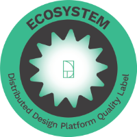

This page is obsolete. Main page was moved [here](../fsf).

I am Felipe Schmidt Fonseca, an experienced Berlin-based Brazilian advocate for social-environmental innovation and free/open-source technologies turned researcher. I am the founder of [Reuse City studio](https://reuse.city) and a co-creator of [semente](https://semente-de.github.io/), a toolkit for community projects; the founder and lead articulator of the [Tropixel](https://tropixel.org) network; and a member of organisations such as [GIG](https://globalinnovationgathering.org/) and [Circular Berlin](https://circular.berlin/). Between 2019 and 2022 I was a Marie Curie Early Stage Research Fellow ([University of Dundee](https://dundee.ac.uk/) / [Northumbria University](https://northumbria.ac.uk) / [Mozilla Foundation](https://foundation.mozilla.org/)). I have recently engaged in collaborations such as [ID21](../stuff/id21-briefing), [fonte.wiki](https://fonte.wiki), [Semente](https://fonte.wiki/semente_en) and [CODE](../stuff/exactitude-maps).

In the last twenty+ years, I was a co-founder and leader of diverse initiatives dedicated to critical thinking (and making) at the intersections between culture, science, technology and society. Some examples are [MetaReciclagem](https://metareciclagem.github.io/), [CulturaDigital.BR](https://web.archive.org/web/20200428202319/http://culturadigital.br/), [Bricolabs](https://wiki.p2pfoundation.net/Bricolabs), [Rede//Labs](../stuff/redelabs), [Lixo Eletrônico](https://web.archive.org/web/20130318073725/http://lixoeletronico.org:80/), [Ciência Aberta Ubatuba](https://cienciaabertaubatuba.github.io/), [UbaLab](https://ubalab.github.io/). I was the user community manager of the [Subutai Platform](https://subutai.io) and occasional [lecturer/panelist/workshop facilitator/teacher/instructor/](../stuff/lectures-talks-presentations) on diverse topics.

I have a [PhD in Design](../opendott) from [Northumbria University](https://northumbria.ac.uk) (Newcastle-upon-Tyne, UK). The title of my thesis successfully defended in September 2023 is "Generous cities – weaving commons-oriented systems for the reuse of excess materials in urban contexts". Before that I got an [MA in Scientific and Cultural Dissemination from Labjor](http://www.labjor.unicamp.br/) at the University of Campinas (UNICAMP) in Brazil, acquired with a [dissertation about networked experimental labs](https://redelabs-org.github.io/livro/redelabs-laborat%C3%B3rios-experimentais-em-rede-2014).

I have two kids. We love travelling, playing music and cooking.

#### More about me

- [My Stuff](../stuff) - projects, talks, writings.
- My [ORCID](https://orcid.org/0000-0002-4764-7069), [Academia](https://northumbria.academia.edu/FelipeFonseca). [ResearchGate](https://www.researchgate.net/profile/Felipe-Schmidt-Fonseca).

#### Contact

[Book an appointment](https://zcal.co/i/TtAvqmhK) to start a conversation or find me in social media:

- felipefonseca on [Linkedin](https://www.linkedin.com/in/felipefonseca) and [YouTube](https://www.youtube.com/felipefonseca).
- efeefe on [Mastodon](https://social.coop/@efeefe) and [Twitter](https://twitter.com/efeefe).
- efeefe.me on [Threads](https://www.threads.net/@efeefe.me) and [Instagram](https://www.instagram.com/efeefe.me/).
- efefonseca on [Facebook](https://www.facebook.com/efefonseca).

#### Texts

- [Seeds of Digital Reforestation](../stuff/seeds-digital-reforestation).
- [Socio-ecological innovation](https://magazine.vunela.com/socio-ecological-innovation-dc1999d556a5).
- [Knowledge, Skill and Labor](../stuff/knowledge-skill-labor ).
- [Transformed Worlds](../stuff/transformed-worlds ).
- [Gambiarra: Repair Culture](../stuff/gambiarra-repair-culture).

