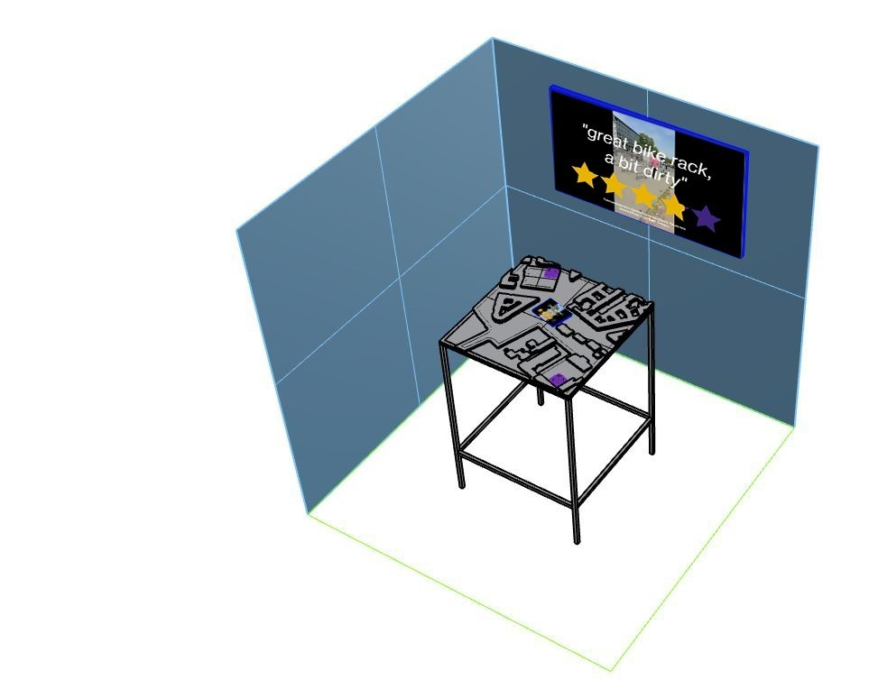
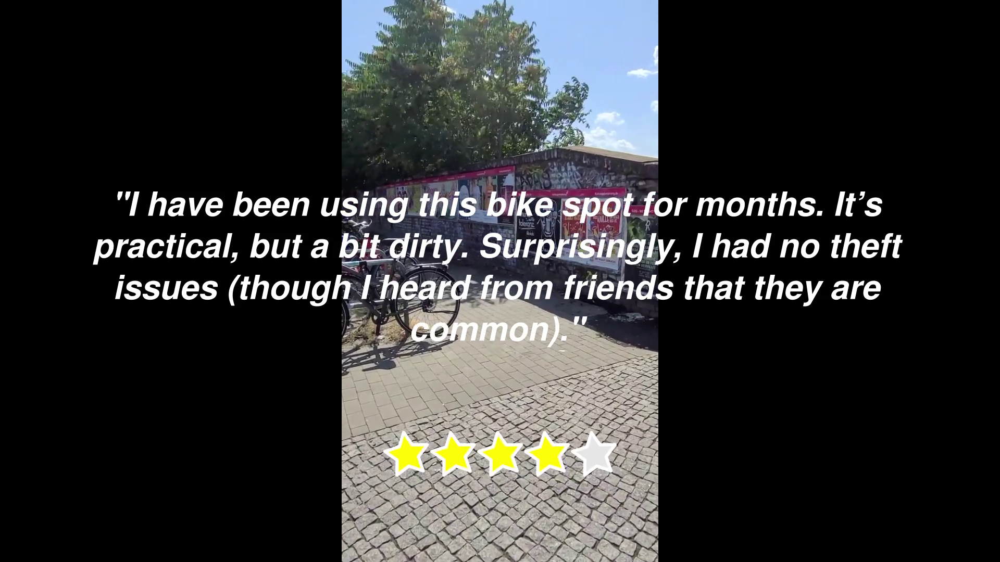
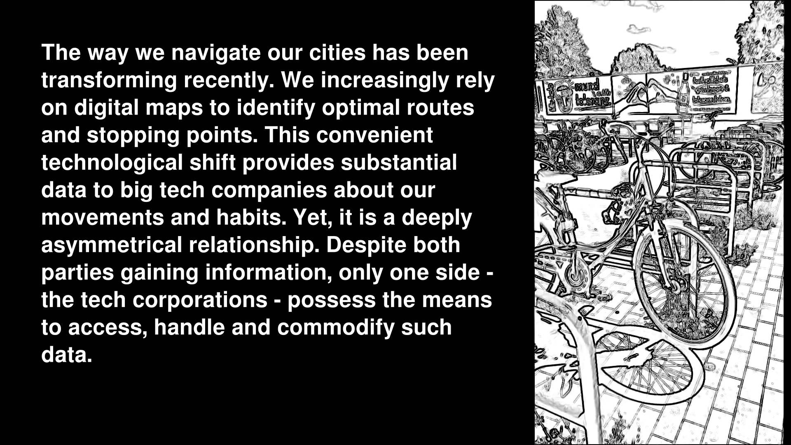
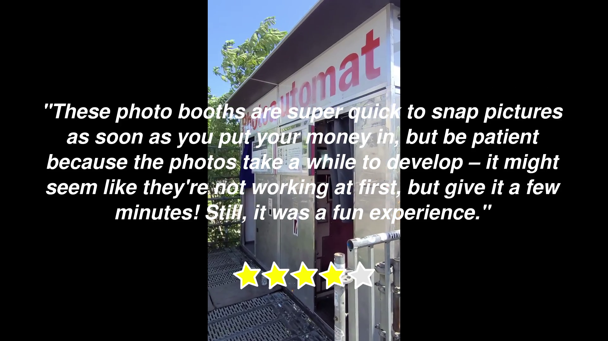
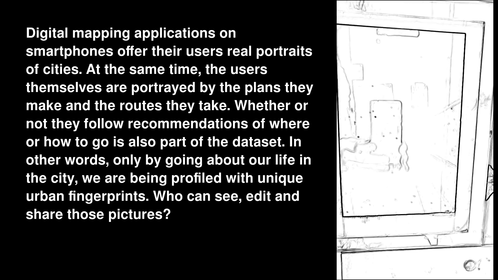

> As part of the CODE programme led by [Impakt](https://impakt.nl), I have collaborated with [Rebekka Jochem](https://www.rebekkajochem.com/) to conduct research and create artworks investigating the impact of maps in contemporary life, labour and cities. The collaboration generated a mobile audioguide and a physical installation.

This piece delves into the world of user-generated geospatial data and how it is exploited economically by tech corporations. In our digital age, real-time digital representations of the physical world are continuously created and updated by people using smartphones, computers, and various devices as they go about their daily lives.

Users not only plan their routes and destinations but also contribute by posting and reading reviews of restaurants, parks, or hotels. Even when they deviate from recommended routes or choose different cafes than the highest-rated ones, they generate data that is immediately captured and integrated into vast datasets. Such datasets not only describe our physical world but simultaneously create algorithmic representations of our behaviors, desires, and potential consumption patterns.

Such data have become a massive resource that a select few corporations are exploiting for profit. It can be used overtly for advertising purposes or for more covert forms of manipulation. Furthermore, it serves as a vital - though not clearly visible - means of production for the digital economy, actively utilized by gig workers in industries such as ride-sharing, food delivery apps, online shopping, and platform-based freelance work, including services like house cleaning and home repairs.

## Images

## Exhibitions

- CPDP (Brussels) - May 2023
- MozFest House (Amsterdam) - June 2023
- Ars Electronica (Linz) - September 2023

## References

- [Link collection - "geolivre"](https://links.efeefe.me/?searchtags=geolivre)
- [On exactitude in science](https://en.wikipedia.org/wiki/On_Exactitude_in_Science), Jorge Luis Borges
  - [Read by Will Self](https://www.theguardian.com/books/audio/2013/jan/04/will-self-jorge-luis-borges )
- [Barcelona's Robin Hood of Data](https://staging.sifted.eu/articles/barcelonas-robin-hood-of-data-francesca-bria/  )
- [Lewis Carroll’ Sylvie and Bruno](https://en.wikipedia.org/wiki/Sylvie_and_Bruno) 
> Another interlude, with "Mein Herr" telling tall tales about his country. He describes how nobody in his kingdom ever drowns, because they have been eugenically bred for dozens of generations to weigh less and less until everybody is lighter than water. He also hears that the largest map considered really useful would be six inches to the mile; although his country had learnt map-making from his host Nation, it had carried it much further, having gone through maps that are six feet to the mile, then six yards to the mile, next a hundred yards to the mile—finally, a mile to the mile (the farmers said that if such a map was to be spread out, it would block out the sun and crops would fail, so the project was abandoned). He goes on to portray some devices similar to modern planetary engineering or terraforming, and paint-balls. Finally, he describes a system of government where there are thousands of kings and one subject, instead of the other way around.

---

*This project is part of [CODE Programme 2023 - Reclaiming Digital Agency](https://impakt.nl/residencies-projects/2023/code-programme-2023-41790/) (Impakt / Transmediale / Privacy Salon)*
