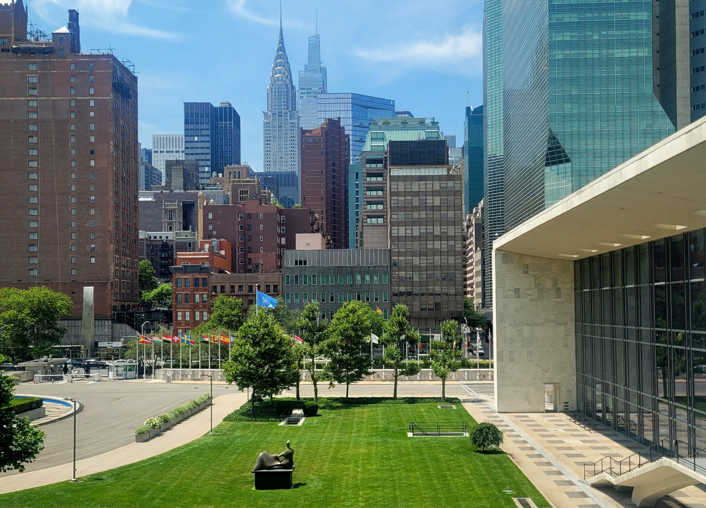

I was recently in New York City, for two combined events about “open source”. Even typing these words right now makes me quite conscious of how this may sound somehow anachronistic these days. Not that (free and) open source software is not present in virtually everyone's lives in one way or the other. In some senses, one might even say that their widespread use makes it so that open source is now taken for granted. In that sense, free-and-open technologies – operating systems, server software, programming languages, user applications, content management platforms, and even hardware – are part of the global infrastructure. On the other hand, there is something about the current vocabulary and culture around open source that feels lacking and deserves further discussion. Two insights here are perhaps simultaneously contradictory and complementary to one another:

- there is a normalisation of open source as an efficient and innovative way of developing technologies;
- there is a sort of watering down of – or giving up altogether on – the more overtly revolutionary potential of open source.

In this post, I won’t try to solve that apparent paradox. It will be addressed in more depth in another series of texts I’m working on and intend to publish soon that recount a bit of my engagement with the topic for over two decades. For now, suffice to say that I can see it, and will come back later.

## OSPO

Now back to the two events in New York. They were organised around the concept of “OSPO”, an acronym that to be honest I hadn't paid attention to until being invited, some months ago. OSPO means “open source program offices”. In a very brief description, they are departments specialised in promoting a transition towards open source. They focus chiefly on software, but may potentially expand to other topics, as I'll explore below. The events were particularly focused on promoting the implementation of OSPOs in government and international agencies, and some examples were described of OSPOs in corporations and universities.

The first event I attended, “[OSPOS For Good](https://www.un.org/techenvoy/content/ospos-good-2024)”, happened at the United Nations Headquarters. Germany and Kenya were its host countries. The second one, organised by the Linux Foundation, was called “[What's Next for Open Source?](https://events.linuxfoundation.org/whatsnext4oss/)”, and happened at the Microsoft Office in Times Square. Both events were structured under the [Chatham House Rule](https://www.chathamhouse.org/about-us/chatham-house-rule), which allows participants to later share the topics and contents discussed, but forbids attribution of individual authorship. For this reason, I'll focus this text more on my personal impressions and observations and won't quote any speaker.

### OSPOS for Good

The [first edition](https://www.un.org/techenvoy/content/ospos-good-2023) of OSPOS For Good at the UN, last year, was attended by 67 people. For the 2024 edition, I heard numbers between 450 and 600. The event didn't have funds for travel and accommodation, which means that most of those hundreds of people – me included – used their own budget (or savings) to be present. That feels like a sign of true interest in the topic. We learnt that the UN agencies have been gradually implementing open source offices, developing communities of practice and suggesting that member-states should follow that lead. The topic follows a series of discussions lately undertaken in the UN and systematised in broad-reaching documents:

- [Our Common Agenda – Report of the Secretary-General](https://www.un.org/en/common-agenda)
- [UN Global Compact Strategy](https://unglobalcompact.org/library/5869)
- [Global Digital Compact](https://www.un.org/techenvoy/global-digital-compact)  

Overall, they signal to open source as a crucial tool to face the enormous challenges we face in the contemporary world, such as climate change and the digital transformation. In the words of some UN officials present in NYC, open source can accelerate progress towards the [SDGs](https://sdgs.un.org/goals) (Sustainable Development Goals). Their view is that open innovation can promote concrete and fest cooperation between organisations in different areas and territories, and open technologies can be used as building blocks for solutions with real-world impact. Even aware of the risk of acriticaly embracing techno-solutionism, I tend to cautiously agree.

The way the UN event was structured didn't make the best use of our time, though. We were at the ECOSOC room, home to the [Economic and Social Council](https://ecosoc.un.org/en). It was of course an honour, but it was structurally quite formal. Discussions depended very much on microphones, cameras, earpieces, and moderation. As a consequence, only one person could speak at any time. And we were too many. Furthermore, there were no breaks between the sessions on those two days, nor were there break-out groups or much time for collective construction. Besides, and perhaps more importantly, we didn’t get coffee between the sessions ;).

During the lunch breaks we would go to the UN cafeteria, but it was not conducive to much exchange, as we were scattered on tables all over, among many people not connected to the conference. There was a terrace with amazing views, but the humid and hot weather made it impossible to stay outside, especially for those of us wearing formal clothes. The only social event in those two days happened on the first evening, in a very loud and hot Biergarten, again an environment not meant for deeper conversation. It was telling that at the end of each of the two days, the participants remained in the ECOSOC room or in front of the lift, desperately making connections. We were attempting to have more human conversations while being escorted out by UN personnel who needed to free the space.

### What's next for Open Source?

The second event was a single-day series of workshops, similarly packed with activities but way more interactive. Most of that day had three sessions at the same time, focused on specific topics of the discussions, interspersed with meal breaks. And we had coffee ;). The fact that we were in smaller rooms and the program had a lot more time for Q&As and open-ended conversations was a positive. The irony of discussing open source in Microsoft’s NYC office - a company which was considered our worst enemy back in the day - was not lost on some of us. I wouldn't say they ceased to be a key adversary, but the game is way more confusing these days. But I won't discuss Microsoft that much here. In any case, I shied away from making any selfies during that day, lest my old peers found them and started bullying me. The day was nevertheless more prone to networking and exploring potential collaborations.

## My observations: the spiral keeps on turning

I will leave aside more general remarks about being in New York for the first time in my life - the curious mix of cultural familiarity and strangeness, the harsh summer weather, how loud everyone sounds. And menu prices without tax and tip. I'll just note that the very existence of the UN premises in the heart of the largest global empire seems to be a sort of miracle. At moments, I had a feeling of latent nostalgia, as if the idea of multilateral construction of the future has, in fact, no future any more. Before being at the UN Headquarters, I never appreciated how remarkable its existence is. It feels like a genuine effort to make the world a better place, or at least avoid its intentional acceleration to potential worst-case scenarios. That, of course, despite its many contradictions and limitations that shouldn’t be overlooked.

Now to the core of it. Firstly, almost nothing that I heard on those three days was new. And that's not necessarily a bad thing. Some stories are worth being re-told, and some questions are not supposed ever to be answered. Witnessing the same types of discussions that we have had regularly twenty years ago in Brazil now making it through to the United Nations is a reminder not to give up. On the other side, though I see the fantastic potential of having the UN pushing for open source practices amid its agencies, member-states and other organisations, it is also a bit sad. I mean, if that support was there twenty years ago, the movement wouldn't have lost so much talent to corporations that are not at all aligned with openness (or the SDGs, or even the concept of “good”). Many innovative and committed people have dropped out because it became impossible to counter proprietary for-profit corporations and still make a decent living. Some of the best among us were recruited by the very corporations we used to challenge and counter. And I believe that process is irreversible.

Then again, the habit of re-telling stories can help make the generations starting now aware of our lessons from the past. Telling again the same story in a different context makes it in fact a different story.

### On past lessons

Some sessions of OSPOS for Good had so many speakers that there was no time for discussions at the end. On other occasions, the time was too short for the complexity and passion involved. Most of that audience had a lot to contribute to the conversations. I only managed to get the microphone on the second day, after raising my hand in various sessions to attempt to comment or discuss, with no effect. My direct intervention during the panel about open source and cities can be seen in the recording below.

  <video width="960" height="540" controls>
   <source src="https://archive.org/download/ff-ospos/FF-OSPOS.mp4" type="video/mp4">
   Your browser does not support the video tag.
  </video>

In those few minutes, I may have succeeded in doing at least part of what I wanted to do for some sessions before: re-telling stories that should be praised when the moment comes that the UN finally hosts a decent conversation about open source. Earlier, a participant had mentioned a colleague who has been working with open source in the government of a US State for twenty years. I am of course familiar with many similar stories. Porto Alegre, São Paulo, Barcelona, as well as Extremadura and Munich, among many others. In my intervention, I wanted to draw attention to a particular sequence of events that happened twenty years ago. I didn't get to mention all of them, but list below:

1. Gilberto Gil is a Grammy-awarded musician with a lifelong interest in technologies and their effects on humanity and the planet. In 2003, he became the Minister of Culture in Brazil. He practically started his tenure participating on a panel during an international festival about Tactical Media. On the occasion, he was surrounded by two other panellists with very diverse views about the internet and digital technologies. John Perry Barlow saw the internet as a place outside the real world, which should not be bothered by governments and regulations. Richard Barbrook had the view that the internet had been created with public funding, and for that reason, there should be considerations about equality and inclusion in its implementation and governance. Gil answered to that tension, basically saying that both were right, and that such difference should be resolved dynamically. He used the image of capoeira movements - a mix of play and fight, of dance and confrontation, of overcoming differences with good spirits.
2. Some months later, Gil played his guitar at the UN General Assembly, making tens of delegates dance along. On the occasion, even the then Secretary-General played percussion with him. I’m aware that this may not seem that relevant regarding open source technologies. The important point here is that he was inspiring people to address contemporary challenges with good mood, and a profound understanding of the role of culture.
3. Some months later, the Minister went to an international festival with thousands of free software developers and supporters in Porto Alegre, Brazil.
3. He then attended the World Summit on the Information Society (WSIS) in Tunis, where he improvised a song with Richard Stallman (founder of the Free Software Foundation, and not that good of a singer).
4. Later, he was featured on the cover of Wired magazine, praising (GNU/) Linux. If I'm not mistaken, the title of that edition was “we pledge allegiance to the penguin”.
 
During all that time and in the following years, Gil declared himself to be “a hacker”, and championed the use of Creative Common licences in the public sector. His Ministry developed policies inspired by and based on free and open source software for the culture sector, and recruited young activists from diverse movements (among them a 20 years younger Felipe) to design and implement them.

It may have been a bit of an exaggeration in my microphone comment to claim that Gilberto Gil was the most important advocate for open source in the Brazilian government back in the day. After all, there were other influential names operating in the country and making things possible by then. Still, he represented a wider spectrum of possibilities, by treating not only open source as culture (as was repeated many times during the OSPOS for Good), but also culture as historically open and not limited to what the entertainment industry understands as culture. Culture as that which makes us human. And crucially, culture as being true commons, if we want to interpret it that way.

The second objective of my short comment was a bit distorted, for nobody's fault but mine. I intended to reference Ivan Illich, who proposes conviviality as a more appropriate goal for humanity than the industrial-era notion of productivity. However, I wrongly used the word efficiency instead of productivity. Even though the objective notion of efficiency can obviously be interpreted in the particular way I intended, it is arguably more ambiguous than that of productivity – making more with less resources, in less time. For that reason, the response I got from a speaker didn’t really address the tension between conviviality and productivity. It was a more balanced take on the need to ensure efficiency when delivering public services, which is of course right. If the structure of the conference was a bit less formal, I think I'd have corrected myself. I will remember that on the next occasion.

In any case, those two points were present in the conversations on and off-stage: awareness of our shared past – the stories of past open source incarnations –, and the need to promote an understanding of open source as being wider than just code or technology. There was an ongoing conversation about the creation of wider-reaching OSPOS designed for the SDGs, instead of simply focusing on creating and maintaining better software.

### Culture and communities

One of the most used words during those days was “community”. I have a thing or two to add to that discussion, and will try to be brief for the purposes of this post - here again, I will soon expand on these topics in upcoming texts. In essence: healthy communities are not necessarily – dare I say not usually? — organised around a single commonality, be it a particular practice or discrete problems. Yes, I also read, ages ago, about CoPs (communities of practice) and how they can promote better communication and a sense of belonging within, or across, organisations. But that to me is a reduction of what communities are and how valuable they are.

Going further, I am particularly against a notion that I heard time and again during those days: that community efforts will only work when there are clearly established boundaries, rules, and codes. Those recommendations are definitely true in some cases. In particular, and problematic in my view, in what I consider exploitative communities: when you have an idea or a product so enticing, that other people will work for free while you are the one profiting. Opening limited and clearly defined means of participation may be a relative improvement, even when not allowing people to challenge the very purposes and directions of the whole. But to me, it feels like a superficial appropriation of the idea of community, and occasionally a waste of good opportunities for more impact. In such settings, participants contribute only if they get something in return. In that, it can be considered as a collective effort driven by transactional selfish interests. And again: communities are a lot more than that.

Of course, some communities are indeed bound by external limits, conditions, and restrictions, as can be seen by the increasing forced migrant and refugee populations. Even in such cases, there can be positive commonalities such as desires, aspirations, and the creation of new worlds instead of organising only around struggles and problems. In my projects, I try to depart from the format of first creating an idea and only then trying to develop a community around it. In numerous instances, it is more interesting - and fair - when we start with the community and then develop ideas together. The obstacle though is to get funding and infrastructure for such an approach that will necessarily take more time, focus on developing relationships and collective care, and not necessarily result in market-recognisable outcomes. Yet, I insist. And I have learnt some lessons that might be worth sharing.

Communities that thrive over time are ones whose members possess multiple commonalities, in many directions. Some community members may share objectives and limitations with some others, but not all of them. And that is OK and to be expected. Likewise, some members may have common perspectives, background, aspirations, and desires. But the flip side is that communities are also sites of difference. Here again I have issues with a specific word (an old habit of mine). Diversity. Diversity is of course important, but the term is sometimes used to actually brush aside remarkable differences. To me, acknowledging differences among community members and subgroups is critical to understand the dynamics of participation, and to have a better vision of existential threats to the community, unseen opportunities, and evolving conditions. One way to go about that is by adopting collective, sometimes even proto-ritualistic, practices that address difference without putting each one of them in a different drawer, and pretending that they are not there.

To return to a point already made above, retelling stories in new contexts serves not only to transmit past knowledge to new generations, as I heard someone say. For now, I won't even go into the practical impossibility of objective knowledge transmission, if we consider the life work of Paulo Freire. But even thinking in terms of mere communication, stories are not only about individuals learning on discrete events. There is a ritualistic side of shared stories.

Storytelling, story-listening, story-recalling. Something that points to the long-term construction of identity and its maintenance. Or its disappearance. As someone pointed during a panel, it would be important to celebrate when communities are discontinued as well. Paraphrasing the old website of Brazilian band Matema when they dissolved: “to rot and become fertilizer”.

One of the organisers of the conferences used the expression “green field” to describe OSPOs in government and in international agencies. Another participant said that “people in your organisations are the seeds”. Expanding on that metaphor (which is completely aligned with the [semente](http://canvas.semente.de) toolkit for communities that I co-created with a colleague a couple of years ago), I am interested in the soil composition of that green field. To me, stories are one of the most significant elements of that soil.

### Education and professionalism

When organisations in that kind of event talk about the need to invest more in education, I have to pause and ask, “what kind of education?”. Here again, if the focus is exclusively on open source as a more efficient way to develop software and hardware, we may be losing focus on the pressing global challenges that the UN SDGs were created to address. There is no real open-source discussion of wicked problems if we don't put an extra effort into building alliances between all the stakeholders, documenting in the open, ensuring long-term permanence of the documentation. It should not be only about doing things a bit better by inviting “users” to give their opinion and by promoting exchange between actors with similar concerns.

I always insist on referencing the work of Prof Antonio Lafuente, who proposes to go beyond “citizen science” and “public science”, towards a vision of “[common science](https://www.academia.edu/15221184/Ways_of_Science_Public_Open_and_Commons)”. His image of “comunidades de afectados” is a good start: everyone who may be affected by any development should have a say, and even the right to question it altogether. The disability movement motto raised by a colleague in the event at Microsoft, “nothing about us without us”, could virtually be expanded to every field.

To my sensibility, education for competitiveness instead of conviviality may make things worse. Education without awareness of the externalities of technologies makes things worse. I don't know about any schools of IT or computer engineering degrees incorporating, for instance, structured reflection in their curricula about the Coltan situation. Same for the international e-waste leakages to developing nations, the exploitation of precarious labour by gig and delivery platforms, the growing dependency on fossil fuel to generate electricity for our gadgets and datacenters, or similar pressing issues.

A source of disappointment during the events was hearing UN officials saying that they wanted to help governments ally with businesses and civil society, and noticing that they only meant big corporations and large NGOs. There's a trove of innovative regenerative and open practices to change the world taking place in small businesses, local associations, cooperatives, and other formats. They often counter the ideology of big business, mainstream media and merely mitigating-centred NGOs, and that would all the more be reason to support them.

An example of competitiveness-oriented questionable practice coming from the digital world that is lately making the rounds on the SDGs and the like are hackathons. The way they are usually structured can be critically interpreted as exploitative and ideologically biased towards market-oriented results. When you invite a lot of tech-oriented young people to spend 48 or 72 hours competing to solve a problem they don't fully understand, what you frequently end up with is a couple of unfeasible or irrelevant ideas transformed into pitch decks to attract startup funding. Most projects that win hackathon competitions are soon left aside due to the lack of support, maintenance and more profound engagement with real communities. Not to mention the aspect of exploiting cheap young labour instead of properly investing on long-term and deeply thought of solutions.

There are exceptions, of course. I particularly like when collaborative hackathons are organised to hunt bugs, to improve the documentation of specific software, or focused on particular minorities, social issues, or excluded demographics. Or when a team that has proper working conditions, but works distributed, has the chance to be together for a couple of days and work on specific issues. Those positive takes could be applied to SDG-oriented hackathons. Instead of expecting that a killer app (I'll skip my vocabulary criticism on this one) will solve this or that challenge, how about we organise commons-oriented events to better understand what system-based solutions have already been tested and how they can be improved? Preferably without the expectation of rapid scaling up and taking over the world. Maybe we should think of hackathons about hackathons, focusing on documenting and developing longer-term maintenance infrastructure for the good ideas that were attempted in hackathons past but went unsupported. Or hackathons focused on creating cooperatives, participatory movements, and mission-oriented businesses. But honestly, I don't think the language and cultural expectations of hackathons focused on startups would be conductive of that kind of outcome.

A point I raised during the discussions was the intentionality of openness. The most accepted interpretation of open source is that it should be agnostic to use. In other words, ecosystems based on open licensing make it so that using open technologies to perform morally or even legally questionable actions does not imply a breach of the licensing scheme. You are free to use the software even to kill more people, destroy more forests, make people poorer, reduce the life quality of populations. Of course, there is a lot to be debated on that, starting from the fact that expecting licensing decisions to solve moral problems is at best naive. But it is another facet of the combined crises of contemporary times, and open technologies can also be crucial enablers of questionable behaviour. Additionally, the fast-paced development of large language models requires us to rethink the meaning and implications of openness from more nuanced standpoints. Not to mention the misuse of the word "open" and the distortions it causes.

To be clear: ethics, political awareness, mission-driven work and, yes, the SDGs, should not be optional modules of IT development and education. Rather, we should start from them and build up, instead of only focusing on making quick money. The generative questions, to reference Freire again, should reflect that. How to design open source technology that makes the world better, aiming at each and all the next seven generations of humanity? How to create open solutions that respect and improve the living conditions of humans and other living species? How to use openness as a driver for systemic change and rebalance the systems of reward, identity, and belonging? How to understand and account for the wider implications of doing things openly?

I suppose we will keep discussing these and other matters. And I hope that it happens in truly open settings, with shared and permanent documentation practices and constant reminders of the purpose and long-term goals. Is there an OSPO community in the making? We will see to it.

---

My travel to, accommodation in and subsistence in New York during the days of the events had the support of the OpenDoTT project (Northumbria University, funded by H2020 Marie Curie Programme) and the Global Innovation Gathering - GIG. I also thank my friend Giseli Vasconcelos, who kindly hosted me and my partner for a few extra days, so I could get to know a bit of the city. Finally, thanks again Paloma Oliveira and all the OSPOS for Good 2024 Committee for the invitations.