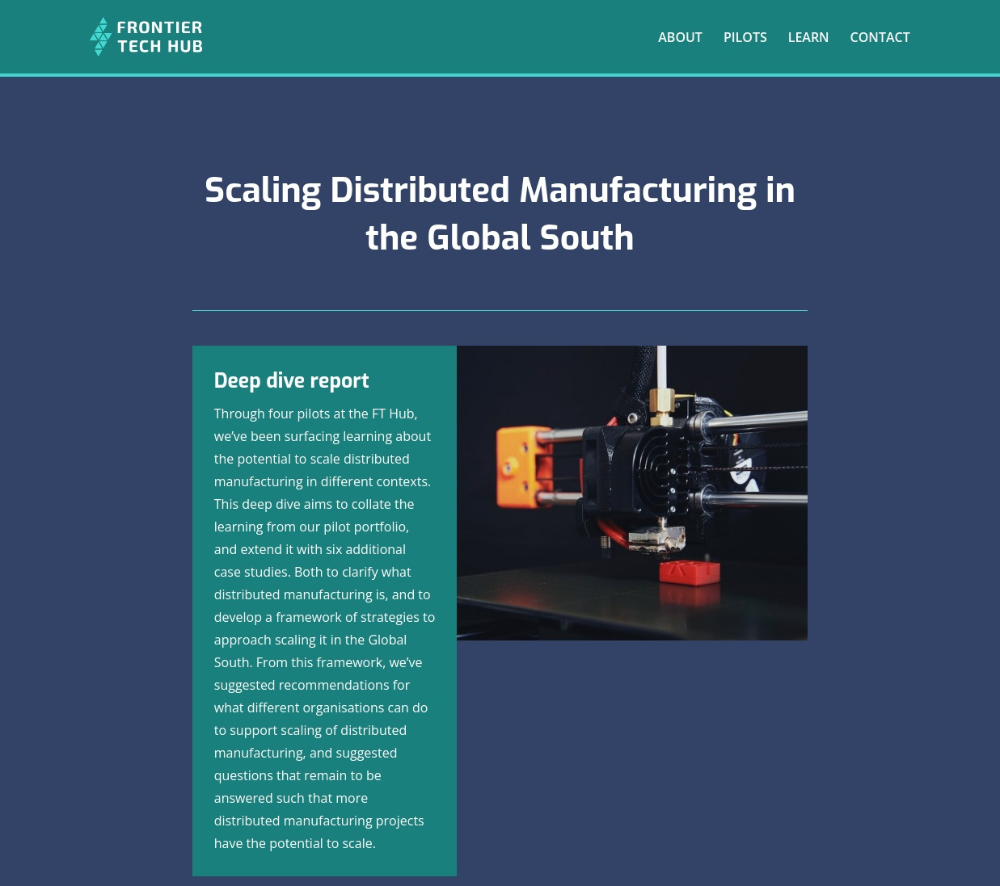

I collaborated with a group of brilliant researchers and practitioners conducting a "deep dive" study about the expansion of distributed manufacturing in the Global South commissioned by the UK's [Frontier Tech Hub](https://www.frontiertechhub.org/). This endeavor generated valuable insights into this crucial domain and allowed us to devise innovative strategies for accelerating the worldwide adoption of distributed manufacturing.

The report can be found [here](https://www.frontiertechhub.org/resources/dm-evidence/) ([internet archive copy](https://web.archive.org/web/20230419093958/https://www.frontiertechhub.org/resources/dm-evidence/) / [Zenodo](https://zenodo.org/records/7916430)).

