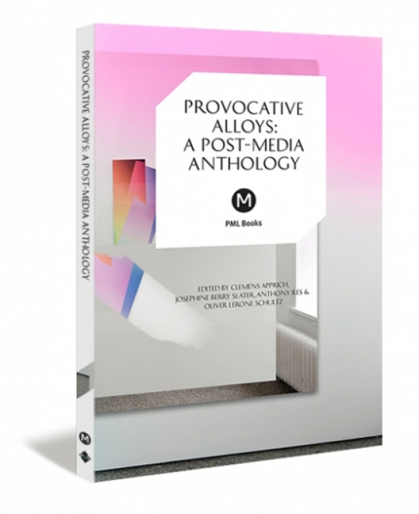

A conversation with Alejo Duque and Oliver Lerone Schulz, published as a [chapter](south-post-media.pdf) of "[Provocative Alloys: A Post-Media Anthology](https://www.metamute.org/editorial/books/provocative-alloys-post-media-anthology)", edited by Clemens Apprich, Josephine Berry Slater, Anthony Iles and Oliver Lerone Schultz.

(Full PDF available [here](https://web.archive.org/web/20231023222602/https://mediarep.org/server/api/core/bitstreams/609dd59d-984d-4cce-9cf3-59dfcece0807/content)).

