*This post collects notes taken during [my first research trip](../first-research-trip) in Rotterdam.
It is followed by another post with my [notes from Berlin](../reparatur-festival-2019).*

### On my way

It's interesting to see the Netherlands from the sky, at night.
Smart cities? Cities? From here, the whole country is a conurbation. Yesterday Nick told me that
about a third of the british population lives in big cities, a third in small cities/towns and
the other third on the countryside. I wonder what the Dutch composition would be. Tomorrow
one of the keynote speakers will be Ayona Datta, who is involved with a project called
'Learning from small cities'. I know Adam Greenfield and her have been disagreeing on articles.
Need to read more about it.

Almost landing... now the whole country feels a bit like Sao Paulo. The city, not the state.
That feeling of looking to either side and seeing no end to the built environment.

I was supposed to get the train to Rotterdam, but it was cancelled. Next one would only leave
in one hour. I eventually found the teller and bought a ticket that would allow me to board
another train and change in Leiden towards Rotterdam. I was told I should get off the first train,
change platforms and get the next one. In fact, I should have just entered the train on the other
side of the same platform. Lost another 30 min for not noticing that.

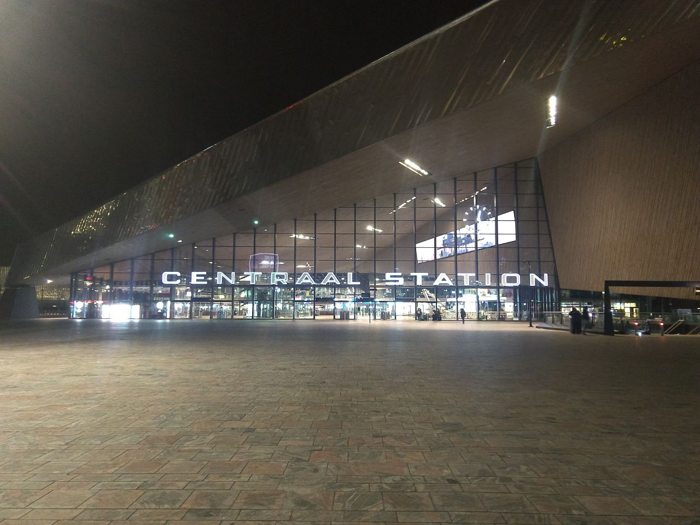

### Het Nieuwe Institut, waiting for the conference to start

Yesterday watching the cities go by from the train window, but also today on my way here, I thought 
about the contrast between the Dutch
architecture and the context I left recently in Ubatuba, a place still being developed. A sense
of scarcity against excess. Two dimensions of openness. To what extent is that which I perceive
as excess a way to elevate the understanding to higher levels, or how is it only a means to keep
the construction industry active? Form over function. The chairs here don't look comfortable for
days packed with sessions and keynotes. The bookstore's selection is gorgeous, perhaps too intentionally.
Green, sustainable, participatory planning and design all around. It seems to be this way not only
to sell books, but to pass along a message about the venue itself.

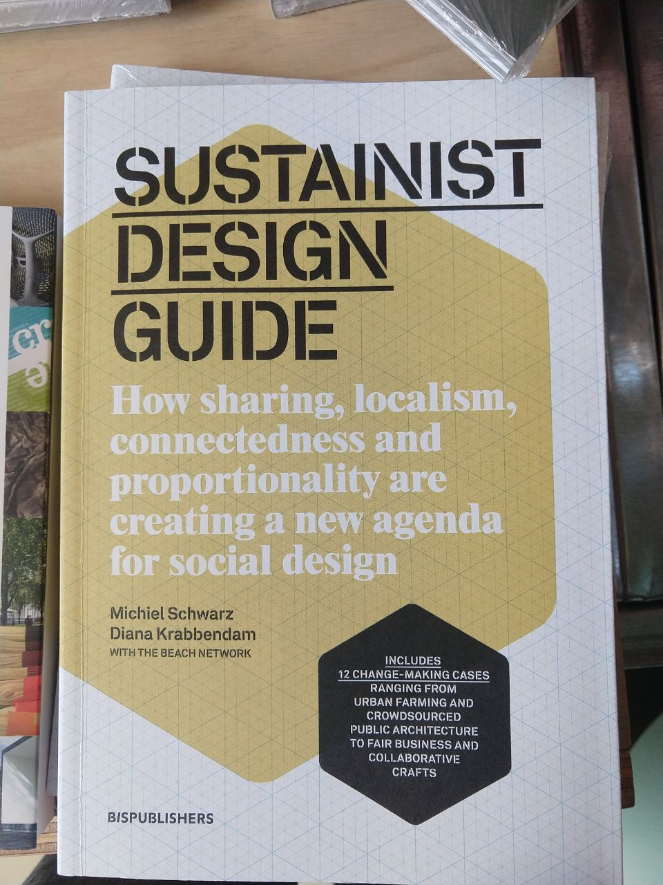

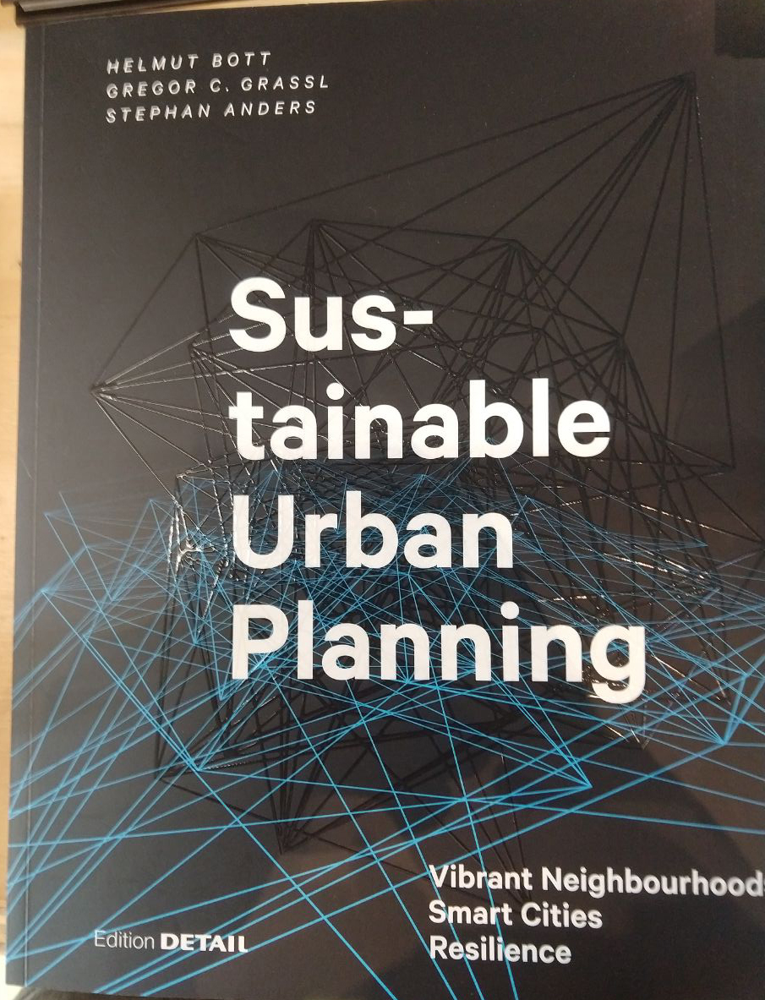

At the same time that a sort of high level cosmopolitism makes me uncomfortable, it also stimulates me.
Perhaps a part of what I have learned about an intellectual sociability has a lot of Dutch influence.
a kind of academic debate with more oxygen than what I see in Brazil. Silent and respectful but
also poignant at times.	

### Who owns the smart city?

[Ayona Datta](https://ayonadatta.com/) talked about a project (AanaJaana) that empowered young women in 
an urban community in
India, using readily available technologies to create communication channels and help tackle relevant
issues of safety and gender. Urban life in the margins. Speak back to the smart city with a
creative practice. Rap + video clip: 'the city is for you and me'. The women were already connected
to local NGOs. Got attention from mainstream media, and the issue of safety and gendered made it into
the discussions for the next elections.

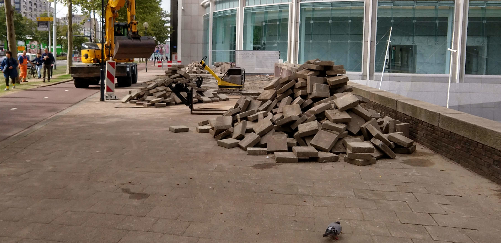

[Bianca Wylie](https://biancawylie.com/sample-page/) brought a very lively account of the Sidewalk Toronto 
project, a 'bar fight wigh Google'. The city was not ready for the project. A governance vacuum.
Dirty tactics used by the private sector. Companies that skip regulation and use people to defend
their space. Shapeshifters. Each constituency saw their own version. Affordable housing, technology,
sustainability, jobs. What's not to like? In fact though, it is a corporation trying to exert power.
Buying consent with 50 million dollars. To every issue raised, they would say 'you are right' - agile 
methods, never ending discussions, but the mechanism wouldn't stop for nothing. Government acts like the
cat bringing you a 'present' - a dead bird. 'Look what I brought!' The corporation is not to blame, but
government is. How to treat it as a collective action
or bring to public consultation if nobody knows what they're talking about? Recommendations about
procurement: granularity, no omnibus procurement. Small/specific, so issues can be raised and properly
discussed. And engage residents before procuring.

Rob Kitchin commented, as a good reminder: ownership of the land. Not only about governance, but also 
tax generation.

### Promises of democracy in the smart city

[Paolo Cardullo](http://kiddingthecity.org/). Levels of participationn. Public infrastructure for the 
internet. Data commons. Smart city: citizen is usually seen as a consumer. Commoning. 
Book: [Omnia sunt communia](https://www.zedbooks.net/shop/book/omnia-sunt-communia/), De Angelis.
Chattanooga, Tennessee. 'The gig city'. 1G internet offered by the public electricity company.
Maintenance of the commons. Remunicipalization and community-run infrastructure. Fort Collins,
Queens, London. Stewardship. [Gentrification in the mesh?](https://research.gold.ac.uk/16180/).

### Beyond smart city pasts, presents and futures

[Rob Kitchin](http://progcity.maynoothuniversity.ie/contributors/rob-kitchin/). 'Programmable city'.
Is another smart city possible?
Book: [Social Justice and the City](https://en.wikipedia.org/wiki/Social_Justice_and_the_City) (Harvey, 1973).
Right to the smart city - not only to the present one, but future as well. Marcuse: 4 temporalities.
**Present future:** future from the standpoint of present. Forecasts, anticipation. Experimental urbanism.
Preemptive hope. **Future present:** plan alternative trajectory. Redirect present onto a new future.
Just _drop the smart bit_: citizens, citizenship, justice. In cities, 'smart' is often considered an
'operational' issue. Staff involved don't go beyond that. Involve ordinary people. Utopia as a method. 
Diversity, difference, global south. Minimal politics. Tiny fissures rather than big seismic change.
Medellin - Social urbanism. Barcelona - technological sovereignty. Morozov + Bria, 
[Rethinking the Smart City](http://www.rosalux-nyc.org/rethinking-the-smart-city/), 2018.

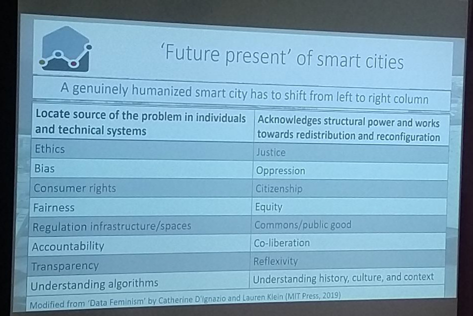

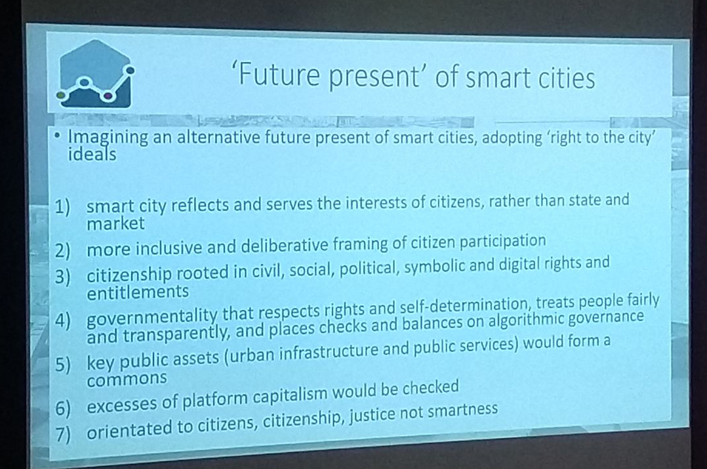

[Alberto Vanolo](https://www.didattica-cps.unito.it/do/docenti.pl/Alias?alberto.vanolo#profilo). 
Torino, human geographer. 1956: L'uomo del 2000. Problems were the same as the ones we have nowadays.
Geodesic domes. Buckminster Fuller. Eden project, Cornwall. Epcot Center - 'experimental prototype
community of tomorrow'. Spaceship world. Autonomous cars, smart cities.  Smart city x Stupid people?
_Forget smartness as a concept_.

### Smart city discourses: global and local constellations

Nancy Odendaal. [Provincial Smart Cities](https://www.provsmartcities.com/). Imagining the smart city.
South Africa, young democracy. Digital city evolved together with democracy. Reshaping agendas of
municipalities. Approach changed over the years. Constellation.

Gayathri Haridas. Singapore. Plans enacted since 1981. Digital readiness. Smart citizen: 4 enablers.
1. Mobile device; 2. Internet access; 3. Bank account with a card; 4. National ID card. Inequalities.
Skills of the future? Voices of foreign workers?

Video screening: [Smart City - in search of the Smart Citizen](https://gr1p.org/en/documentary-smart-city-in-search-of-the-smart-citizen/)
(available [here](https://vimeo.com/138648785)). Discussion later. Rob Kitchin: stop researching smart city altogether.
The disconnect in the room. Ayona: in India and South Africa, authorities and industry will never go
on record. Real issue is not privacy, but politics.

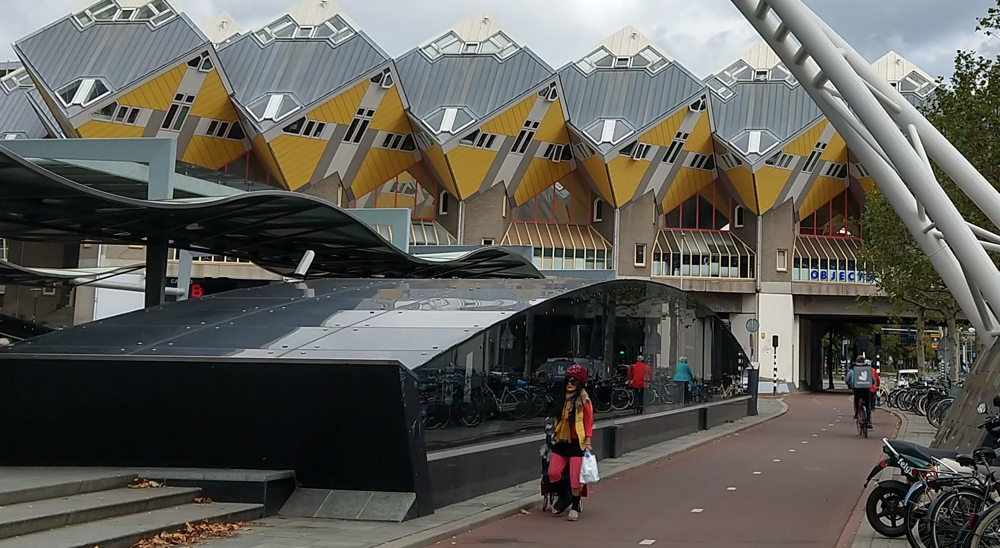

### Dissensus and memory in the smart city

Maria Kaika. _Don't call me resilient again_. Immunity metaphor. Smart city - a totem to our wish to
repair cities. Maasdar - precarious labor. Green gentrification in San Francisco Bay area.
Anti Eviction Movement in Barcelona. Instead of building consensus, find other actors. Shift from 
big data to quali data. 136.gr, collective water management. Smart solutions do not address the causes.
It is a political matter rather than a technical one. Not consensus, but dissent.

Willem Schinkel. Memory and history in smart cities. Selectivity makes a system time-resistant. Memory
as a substitute to the incapacity to observe. Benjamin: memory is not meant to make the past redundant,
but to bring it to the present and shape the future. Markov chain - repeat present in the future.
Proliferate the observers to look for memories outside enclosed 'smart' systems.

### Concerns and contexts of citizen data 

Sage Cammers-Goodwin. Dumb city. Are most cities already smart? Notions of smartness.
Knowledge -> value -> reaction. Who is trying to be smart? Corporations, Governments, Citizens?

### Programming decency in the smart city  

Michiel de Lange. Controversies in responsible smart cities. Well-known criticisms. Empirical smart city
/ conceptual smart city. Control. Justice. Unbubbling. Good citizen x bad citizen. Cooperating / willing.
Controversing - we _need_ controversies.

Linda Kool. Local government is the true innovator. Urgent upgrade: protect public values. 
Directed digitalisation.

### Rethinking smart city scholarship

Roy Bendor (with Jan Misker, V2_). Charles Taylor, 2004 - social imaginaries. Sassen - Cityness.
Necessity and inevitability of the smart city is never discussed. Technologies are only part
of the larger discursive field. Shadow smart cities. Instead of treating the public as audience, 
engage it.

From the discussion afterwards: Sage asked about low budget smart cities. Global south / global east.
V2: residencies. Survival as a given. Rob: not only whose smart city, but also why smart cities?
Discussions here are often about real estate, no mention of capitalism.

--- 

Walking around Rotterdam, trying to understand how I felt. Chico Science on my earphones, manguetown.
Not yet able to solve the question with
excess, aesthetization, a certain splurge. Yes, on the one hand there is a direct relationship 
between architecture and civility, sociability. Rotterdam looks welcoming, breathing, most of all
living. Different from what I felt in Doha, different from Shenzhen. Large scale, it must be hard
for one to feel empowered. On the other hand, expansion of capitalism, West India Company, 
mercantilism. Harbour. Oil. Externalities - environmental and social alike. We - south americans,
and also africans and asians - are not outside. We're part of this thing, despite a discourse of
meritocracy and apparent civility. I like seeing people, and bikes, and some level of urban mess, dirt.
I think, as I did on the plane and on the train, in material flows and their human configurations.
The city as a makerspace is a superficial approach, indeed. But I'm not becoming an urbanist myself.
Prototyping and probing, with a critical take.

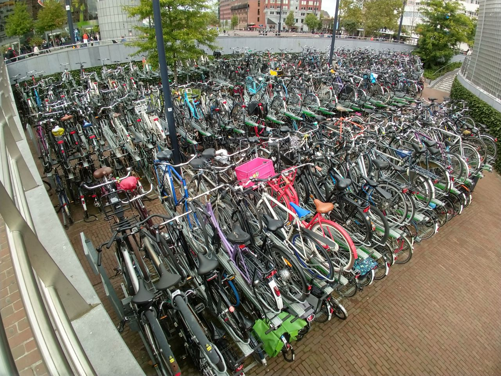

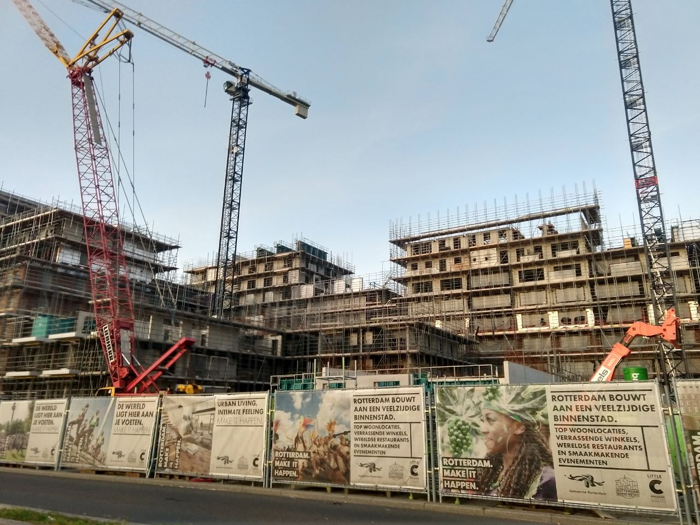

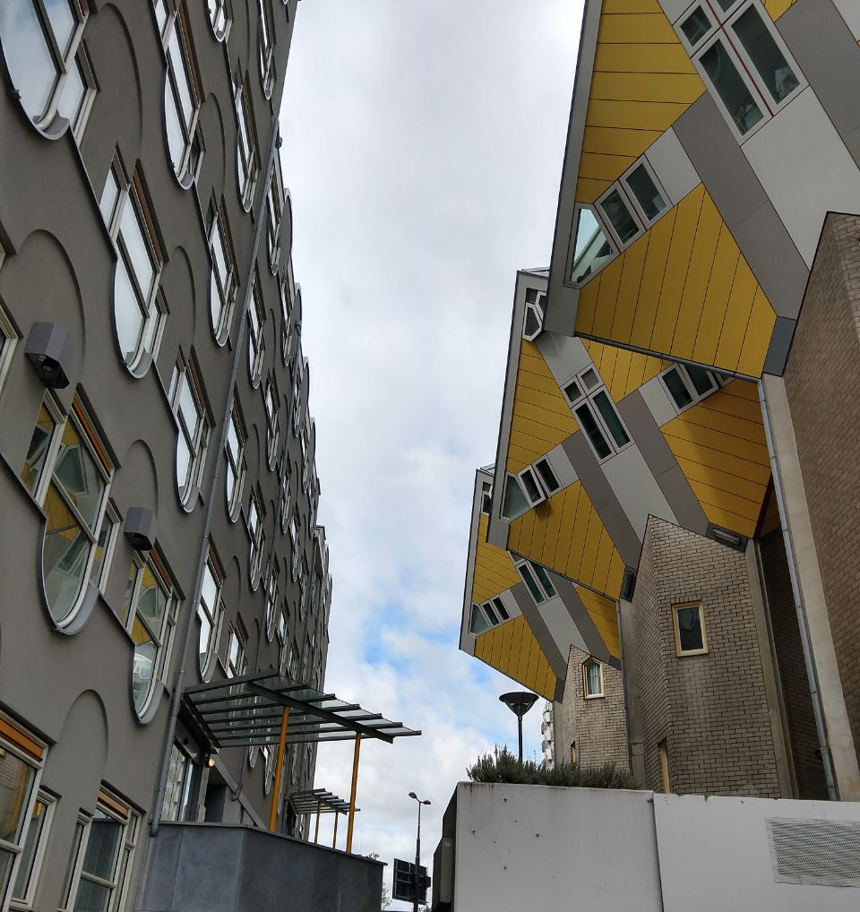

People on outside tables of a cafe. All of them face the street, even when sitting in pairs or more.
Is it this cafe only, or a cultural thing here? In Brazil we would face each other when in pairs.

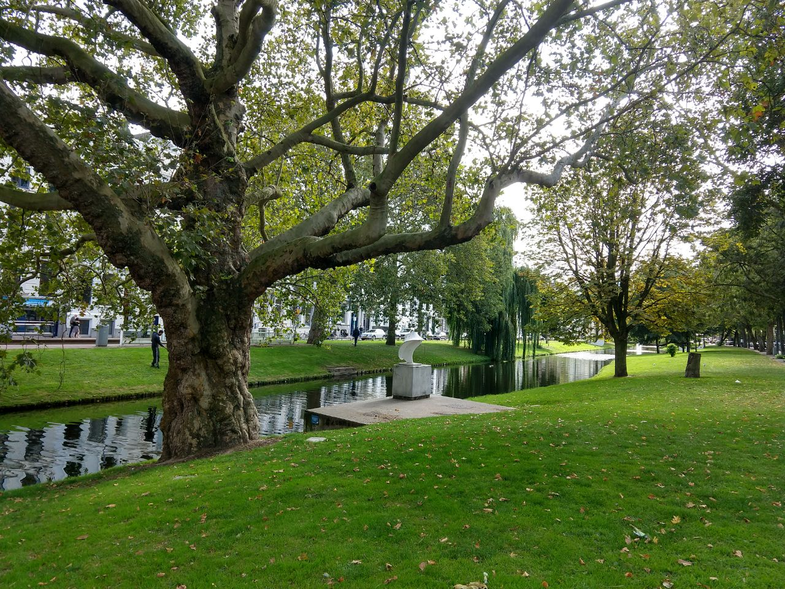

Trying also to process the shock I felt some months ago while meeting a friend whose origins are
on digital inclusion and open source, but has recently converted to the value of street cameras
for municipalities. Is he becoming Mr Hyde and not noticing it?

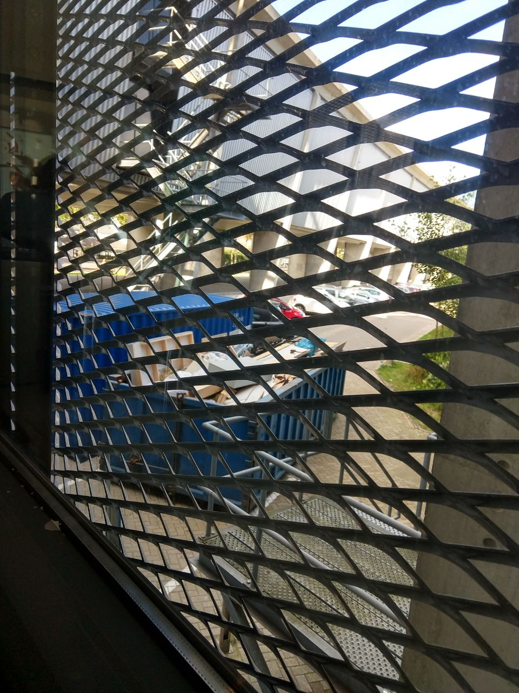

On another take: how is belonging in urban context related to consumption? Singapore - bank account.
A credit card and bank account make things easier - rent a car, use shared bikes, pay council tax
or utilities bills, register for public transport smart cards.

Then - boats. Harbour. Port of Rotterdam. Atlantic connection to my former life in Ubatuba. Feels good.

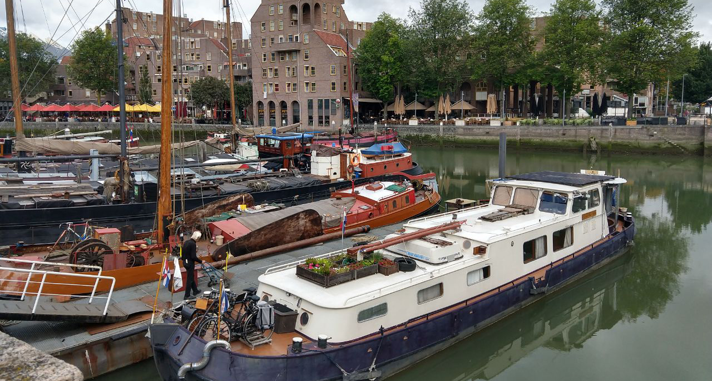

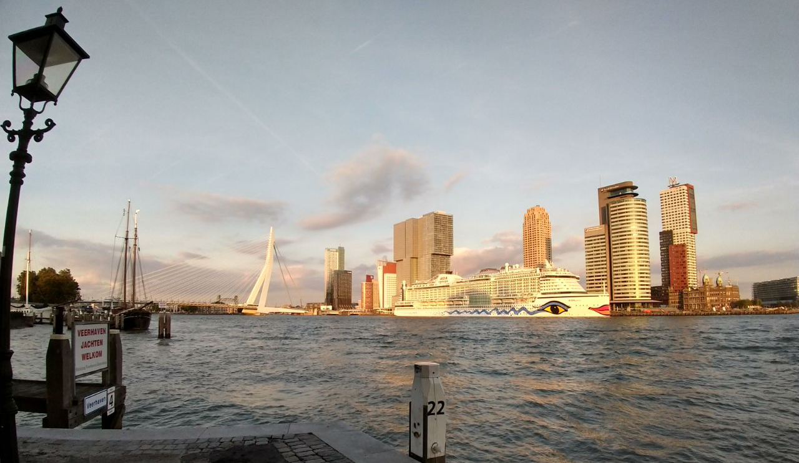

It's been years since I last had the chance only to attend a conference and not
present anything, and that itself was liberating. I met old friends and made new ones, but didn't
need to think about my slides, presentation or time slots. 

By the end of the conference, I felt as though I had a crash critical course on the smart city and
its implications. But I do agree with one of the last comments made by Rob Kitchin: there was
little to no discussion about capitalism, labor and how value is generated. It is as if the
whole discussion was about the city outside the world of work. And that in a sense is a superficial
approach, as urban life is to a great extent organised around work. By the way, it was Rob who cited
the work of Francesca Bria and Evgeny Morozov, _rethinking the smart city_, of which I hadn't heard
before. It's curious because I've been following Francesca's work since some years, and also because
on my way to Rotterdam I was (coincidentally?) reading another article written by Morozov, 
[Capitalism’s New Clothes](https://thebaffler.com/latest/capitalisms-new-clothes-morozov).

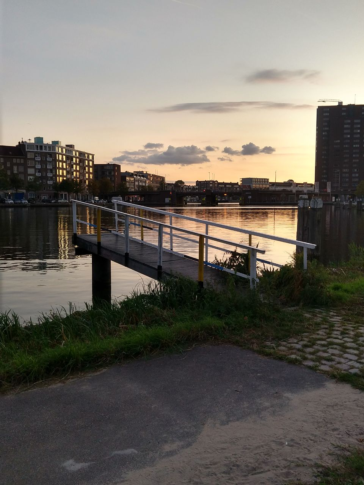

En route to Berlin by train: trying to escape from the tension between well-intentioned excess and
precarity (both the willingly self-inflicted one and the one caused by the lack of alternatives).
Today is the global climate strike. I am in a train, yes. But I eat beef and in a couple days
I'll be flyin. How to balance it all?

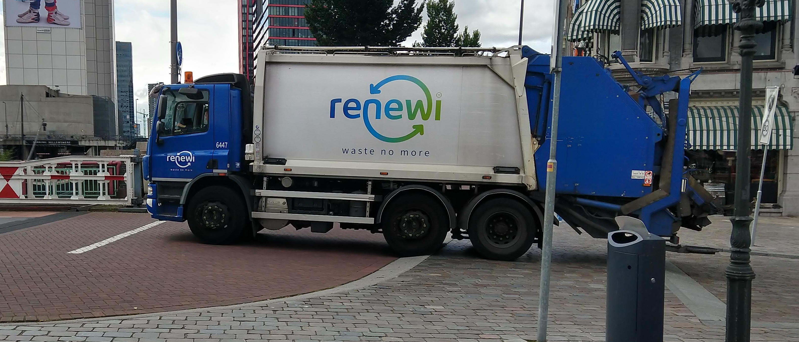

I have just finished Morozov's article and started reading his and Bria's essay on smart cities.
Other perspectives. Smart cities in a broader sense, not only Cisco/IBM/Siemens, but also Google,
Uber, AirBnB. Counteract commodification, the supremacy of market as the way to organise the world
and society. I turn my eyes back to the questions I would like to address in my own research.
Waste. An object in a landfill is... a waste of value. How to say 'desperdicio' in english? Wastage?
An object in a landfill is value being wasted. An object in an incinerator is value being wasted
(and generating a very slight benefit when it propels electric fans). An object getting recycled
may also be wasted - and generated further waste, toxic implications, transform value into smoke.
Build around that. Think of environmental and economic implications. Demonstrate it.

