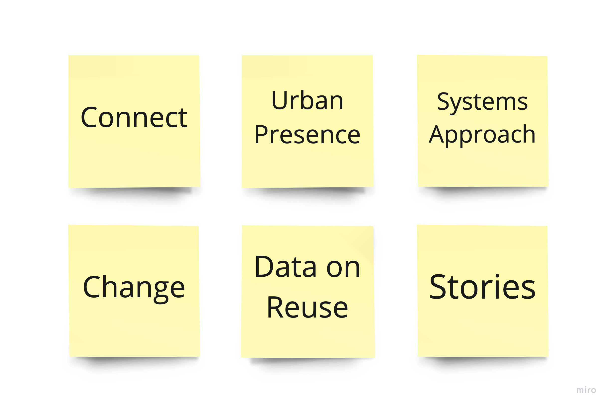

! This post is a work in progress. This warning will be removed once I'm done editing it.

### To do

Still to add to this post:

- methodology
- short description of participants interviewed

> For the Ecosystem Mapping, I have interviewed people who have a professional or informal relationship with repair and waste management. The main idea was to understand how the value of discarded materials can be assessed from diverse perspectives, and what kinds of transformations, equipment and knowledge are involved.

### Research Study Design

The aim of the Ecosystem Mapping was to acquire a systemic understanding of how materials circulate and are transformed in a local context. It ties with the goal of providing concrete evidence about the types of equipment, methods, and information currently in use, in order to inform subsequent phases of my research that will involve prototyping and policy recommendations.

The goal of the project was to understand how discarded materials circulate in the urban context, as well as where and how they are handled and transformed. I was looking particularly into how potential value is assessed in different kinds of facilities, and what types of equipment, methodologies and data sources can aid in that. I expected to do that by interviewing managers and staff working at places responsible for solid waste treatment, as well as organisations and companies that repair, repurpose or receive donations of different types of materials.

The research aimed at investigating the ways in which broken, malfunctioning or discarded materials circulate in cities, as well as where and how they are handled and transformed. It was interested in practices of repair, reuse and recycling of said materials. In particular, the study expected to understand the different types of equipment, skills and information that are used in those practices.

### Topics

* Connect
  * Sources of materials
  * Transformation
  * Destination - shoppers, communities, recycling
* Urban presence
  * Workshops / Local manufacturing
  * Donate / Sell
  * Repair
  * Buy / Be given
* Systems approach
  * Business models for different actors
  * Commons governance
  * Social need - Opportunities
* Change
  * “Trending” vs. “Ethical decision”
  * Behaviour / Education / “Niceness”
  * Concrete incentives - Policy / Taxing
  * Autonomy / Sovereignty
  * Islands / Rural areas - resourceful
* Data on Zero Waste / Repair / Reuse
  * Generate / Integrate
  * Manage
  * Publish
  * e.g. charity shop refuse
* Stories / Curation / Presentation
  * Find information
  * Remove information

### See also

* [Repair Journey](../repair-journey)
* [Concept Ideas](../../concepts)
