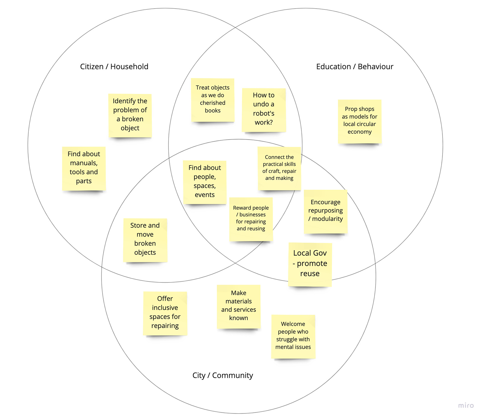

! This post is a work in progress. This warning will be removed once I'm done editing it.

### To do

Still to add to this post:

* the original idea, broken probes
* methodology / analysis / theme clustering

> In the [Repair Journey](https://opendott.org/repair-diaries/), I have asked a group of participants to choose an object they would like to repair or repurpose, and spend two weeks keeping a diary of how the repair (or attempt to repair) went.

### Research Study Design

The research study was designed to investigate ways in which materials that are broken, obsolete or otherwise inadequate can be repaired, adapted or transformed within urban contexts. In particular, the study expected to understand how the value of an object is perceived in different situations. It was part of a wider research project investigating alternatives for handling discarded materials in the city.

Those who participated in the study were asked to start a repair diary of one object that is either broken, malfunctioning or inadequate. Each participant was able to choose the object their diary would focus on. It could be an object they were interested in exploring currently or some notable experience they have had in the past. During those two weeks, participants were asked to reflect upon the value of the object, in what ways it could be made usable and how easy it was to repair or repurpose it. Stories of failed attempts were considered as relevant as successful ones.

By the end of the two weeks of exploration, some participants met for a closing workshop. During the workshop, participants were asked to report how their journeys went, as well as to discuss what would need to be changed in the city to make the reuse of materials easier, more effective and more enjoyable. The main goal of the workshop was to understand what should be different in cities in order to allow society to reuse more of the materials they discard. Some participants were interviewed individually due to calendar conflicts or connectivity issues.

### Notes and insights

### Actionable clues

* How to find about manuals, tools and parts?
* How to identify the problem of one specific broken object?
* How to reward people for repairing?
* How to find about people, spaces, events?
* How to store and move broken objects that can still be repaired?
* How to offer inclusive spaces for repairing?
* How to encourage repurposing by modularity?
* How to treat more objects as we do a cherished book?
* How to connect the practical skills of craft, repair and making?
* How to undo a robot's work?
* How to make Local Authorities and Councils more active in promoting reuse?
* How to make materials and services known?
* How to use prop shops as models for a local circular economy?
* How to welcome people who struggle with mental issues?

### See also:

* [Repair Journey - preparation](../repair-journey-preparation)
* [Repair Journey - a personal diary](../repair-journey-a-personal-diary)
* [Concept Ideas](../../concepts)
