After attending the Beyond Smart Cities Today conference in Rotterdam, I boarded a train
to Berlin. I was participating on the Reparatur Festival, german edition of the Fixfest 
originated around the community of Restart Project in the UK. Coincidentally, the first
day of the event was also the date of the Global Climate Strike, which almost by chance
ended up reinforcing the environmental aspects of repair.

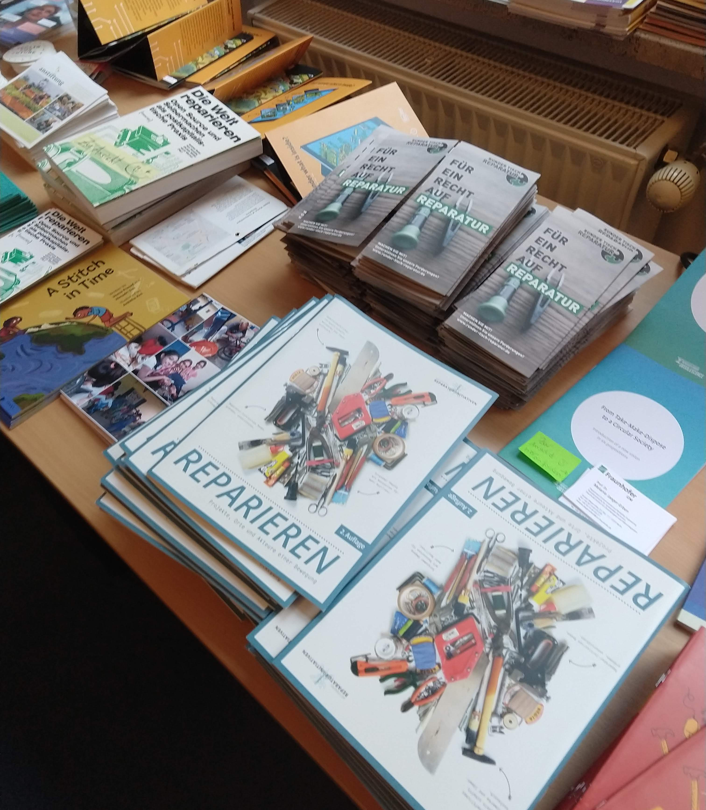

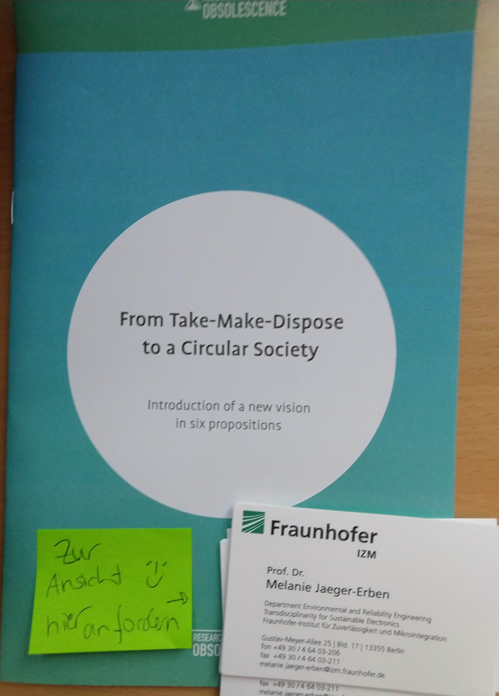

I have been talking to the restarters since some years, and was excited with the opportunity
to get to know the community a little closer. Even more so as [my research](../) seems to be
moving towards collective systems to address post-consumption / discarded objects. My days
in Berlin provided useful insights and some practical examples. My notes are below.

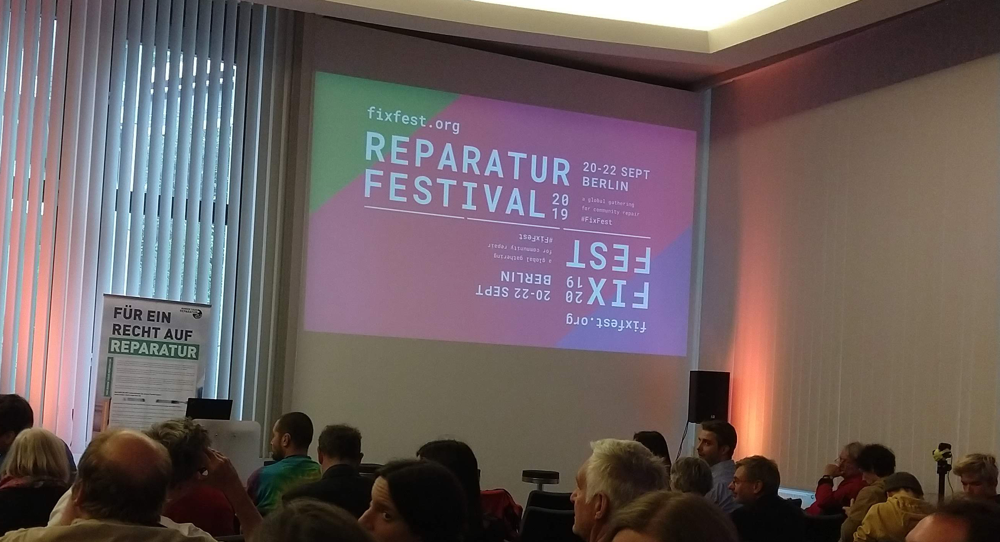

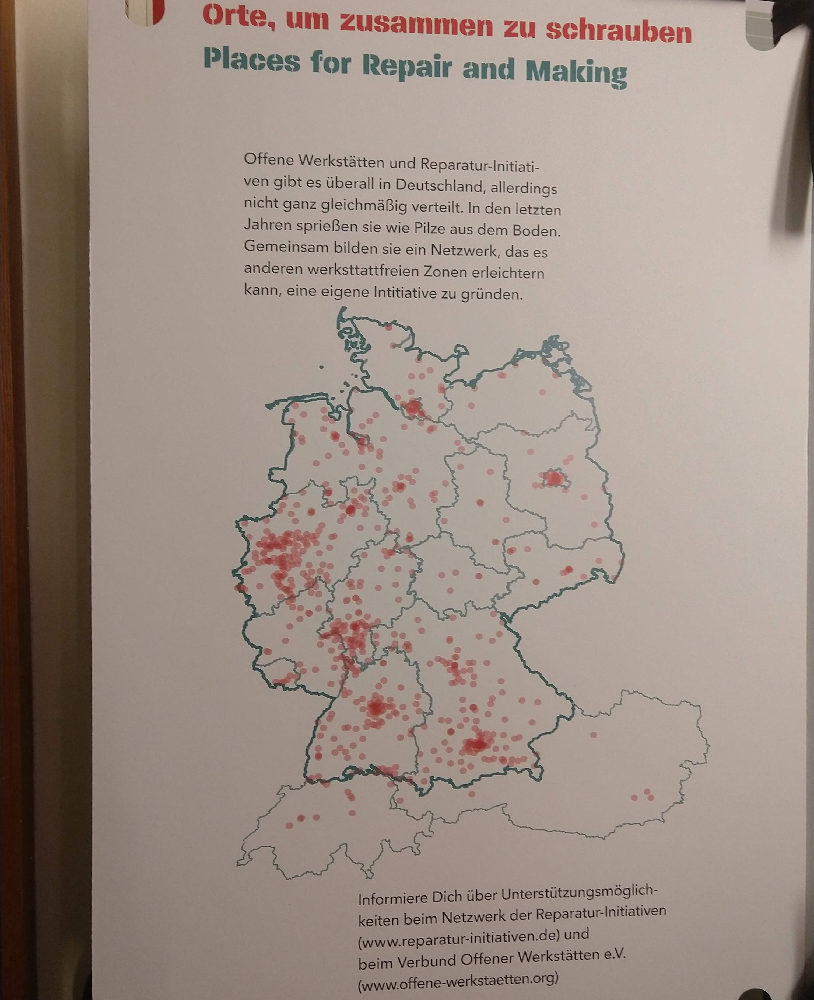

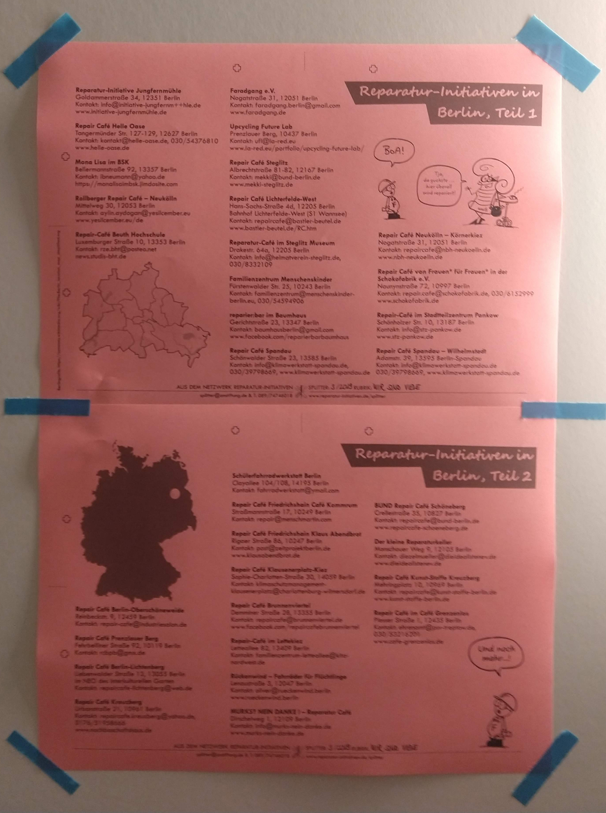

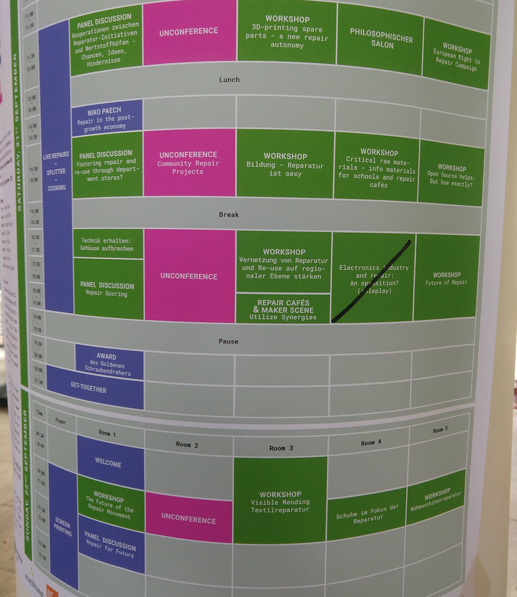

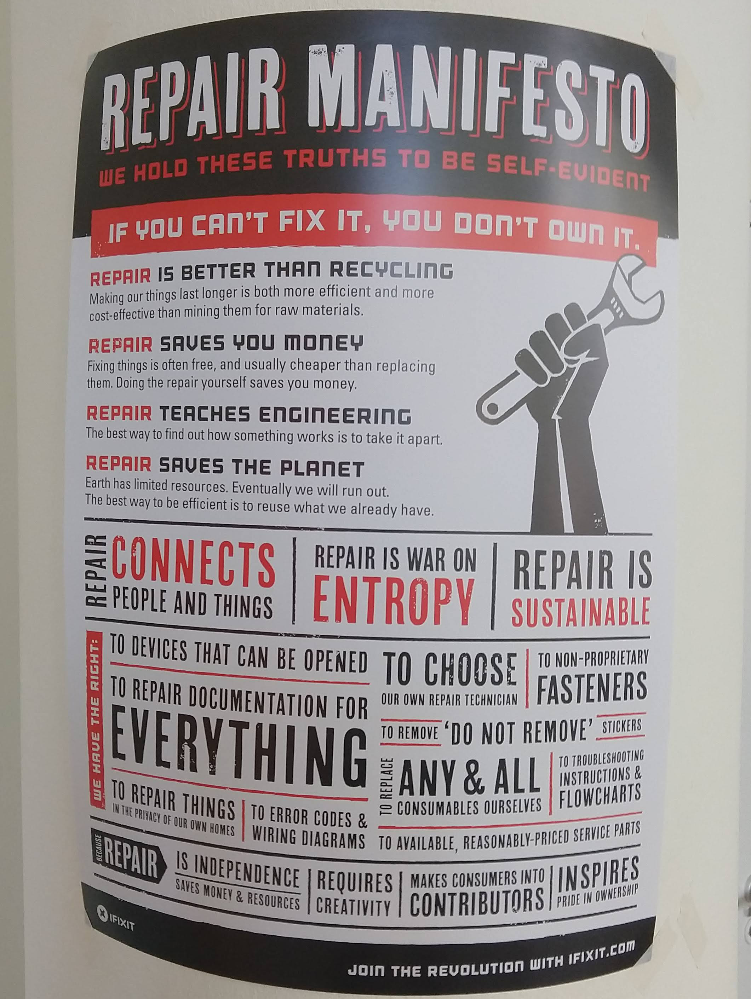

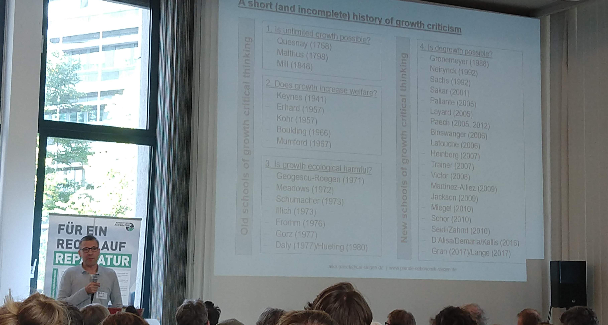

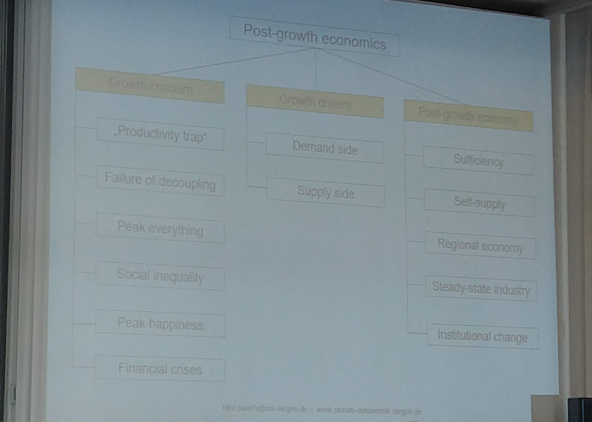

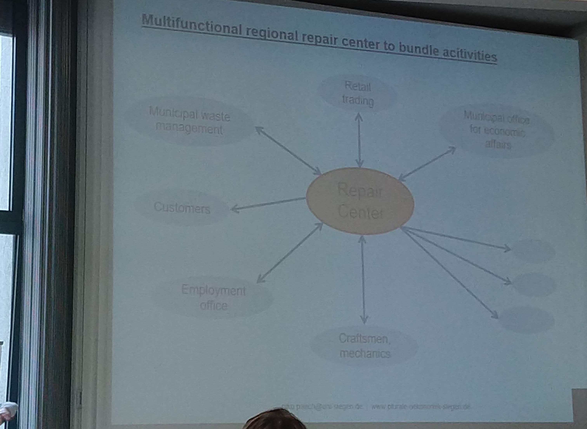

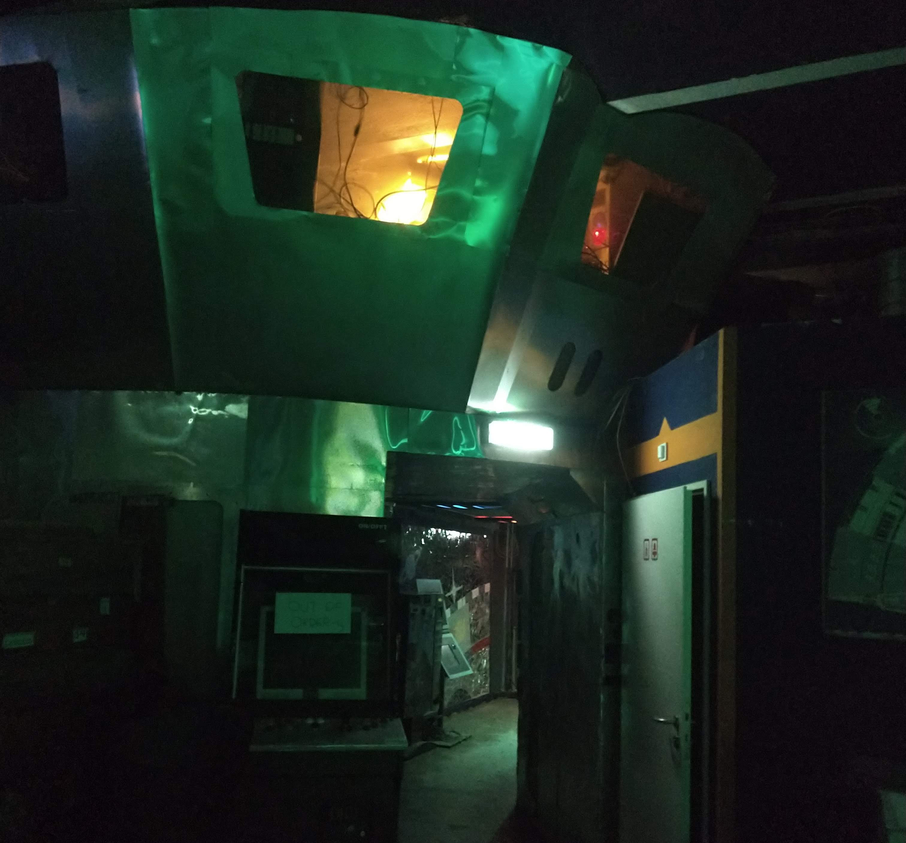

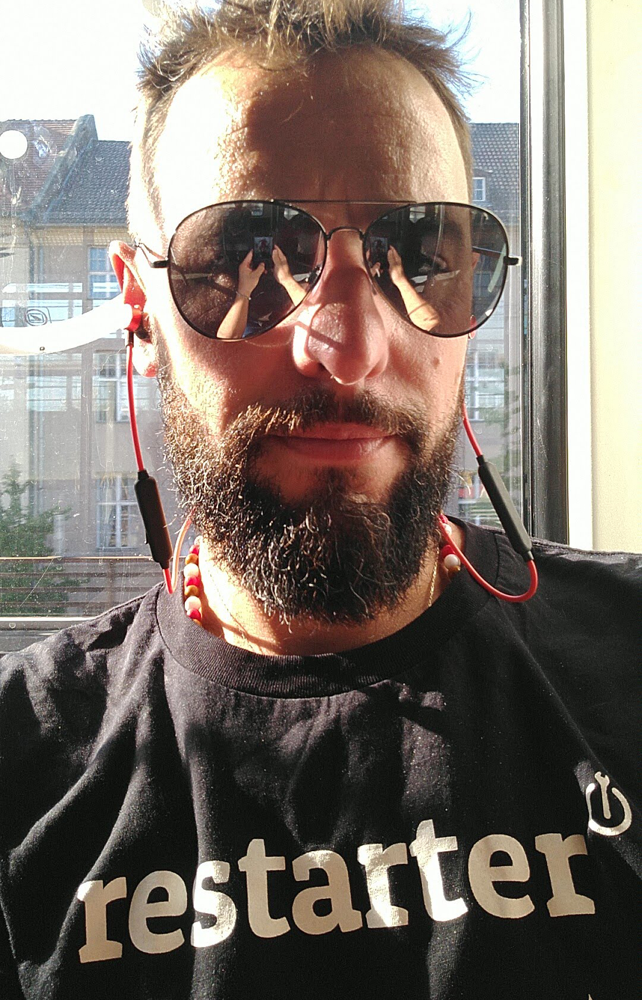

---

I was fortunately able to split my contribution to the conference into two. On Saturday, I joined a session on the unconference about
repairing in global contexts. I had about ten minutes to talk about my experience with MetaReciclagem and some related projects in Brazil.
Then on the next day, I joined the closing panel and talked about things I have done more recently - in particular since my residence
in Doha, then [Transformatéria](../transformateria) and finally a quick glance of what I'm into right now. Below are the slides I used
in this last session.

[pdfjs=felipe-fixfest.pdf]

The Q&A that followed was very interesting.

---

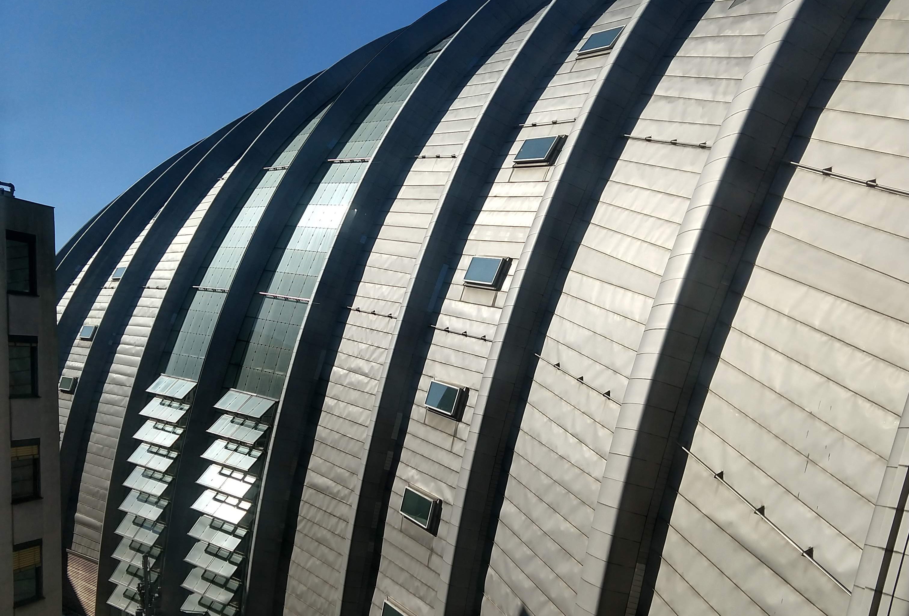

