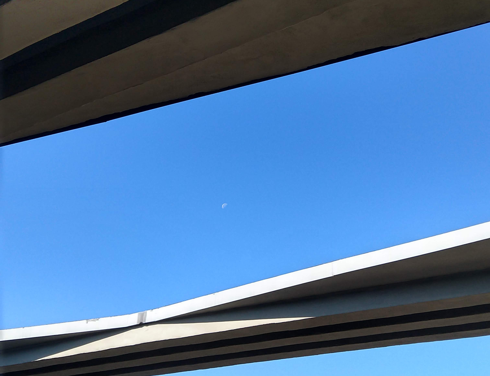

After attending the Beyond Smart Cities Today conference in Rotterdam, I boarded a train
to Berlin. I was participating on the Reparatur Festival, german edition of the Fixfest 
originated around the community of Restart Project in the UK. Coincidentally, the first
day of the event was also the date of the Global Climate Strike, which almost by chance
ended up reinforcing the environmental aspects of repair.

I have been talking to the restarters since some years, and was excited with the opportunity
to get to know the community a little closer. Even more so as [my research](../) seems to be
moving towards collective systems to address post-consumption / discarded objects. My days
in Berlin provided useful insights and some practical examples. My notes are below.

---

