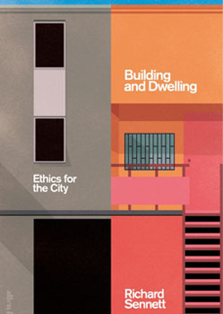

## Building and Dwelling

### III. Repair - the test of quality

p. 287

> Cities as constantly in need of repair - a fact which is not news to any urbanite navigating torn-up streets, suffering from electricity brown-outs, or boarding antiquated public transport. As a practival matter, repairs of defective construction cost more than doing the work right in the first place. Penny-pinching, delayed maintenance makes transport harder to repair, as with commuter railroads in New York and London.

(...)

> In general, an open city is more reparable than a closed city. It is looser in operation, its power relations are more interactive than dierective, it is thus capable of adapting and retooling when things go wrong or come to the end of their useful life. That's the principle. In practice, how should an open city go about making repairs, how can it become resilient?

p. 288

> In approaching a broken case, a craftsman can follow three different strategies: restoration, remediation or reconfiguration. These three strategies are just those a city can use if under attack from climate change or ruptured from within.

- *restoring* ... make the object look just like new.
- *remediation* ... the object does what it was originally meant to do.
- *reconfiguration* ... recomposing \[the object\] in function as well as form.

p. 289

> In reconfiguration, the craftsman becomes an inventor of form, rather than the servant of forms conceived by others.

(...)

> These three forms of repair span the gamut from closed to open form. Restoration is a closed kind of repair: the model rules in materials, form and function; in remediation, the materials are set free but there is still a tight tie between form and function; in reconfiguration, that tie is loosened, even though the materials remain those of the original.

## The cratfsman

### Making Repairs / Fixing and Exploring

p. 199

> The sociologist Douglas Harper believes that making and repairing form a single whole; he writes of those who do bith that they possess the "knowledge that allows them to see beyond the elements of a techniqute to its overall purpose and coherence. This knowledge is the 'live intelligence, fallibly attuned to the actual circumstances' of life. It is the knowledge in which making and fixing are parts of a continuum". Put simply, it is by fixing things that we often get to understand how they work.

p. 200

> The simplest way to make a repair is to take something apart, find and fix what's wrong, then restore the object to its former state. This could be called a static repair; it ocurs, for instance, when the blown fuse in a toaster ir replaced. A dynamic repair will change the object's current form or function once it is reassembled - if a broken heating filament in the toaster is replaced by a more powerful filament, the device might be able to toast bagels as well as sliced bread. At a more complex technical elvel, the dynamic repair may involve a jump of domains, as when a mathematical phormula corrects defects in observed data. 

(...)

> Acts of repair are a proving ground for all tools. More, the experience of making dynamic repairs establishes a fine but definitive line between the fixed and the all-purpose tool. The tool that simply restores is likely to be put mentally in the toolbox of fit-for-purpose-only, whereas the all-purpose tool allows us to explore deeper the act of making a repair. 

p. 204

> We are all familiar with the saying of Heraclitus that "no man ever steps in the same river twice, because it is not the same river and not the same man." The craftsman will not construe this dictum as suggesting that life is purely flux and flow. He or she may simply rethink how to do things when repairing them; limited or difficult tools may prove useful tools in that work of renewal.

