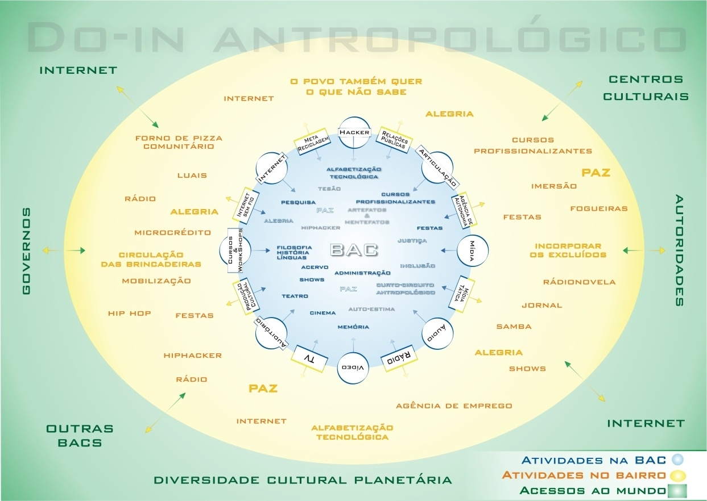

Over the course of the last two decades, I had the occasional opportunity to engage with policy-making on different capacities: as a social activist, a formulator, a campaigner and an advisor.

<a id="culturadigital">&nbsp;</a>

## Cultura Digital - hacking institutional infrastructure

In the last quarter of 2002, president-elect Lula da Silva appointed [Gilberto Gil](https://en.wikipedia.org/wiki/Gilberto_Gil) as the Brazilian Culture Minister. Throughout his long career as an international musician, Gil had been connecting traditional, popular and contemporary cultures from Brazil and the world. When he became a Minister, Gil was particularly interested in the role digital technologies could play. Just a couple of months into his tenure, he was invited to host the opening panel of a Festival in São Paulo.

That Festival, [Mídia Tática Brasil](https://midiatatica.desarquivo.org/2002-2005/midia-tatica-brasil/), was about the then-emerging field of tactical media, which in broad terms proposed the instrumental use of media and information technology by social movements and interest groups as instruments for political struggle. The Minister’s role was delicate at that opening: mediating a panel composed of authors with radically divergent perspectives. On one side was [John Perry Barlow](https://en.wikipedia.org/wiki/John_Perry_Barlow), founding member of the [EFF](https://www.eff.org/) (Electronic Frontier Foundation) who had written “[A Declaration of the Independence of Cyberspace](https://www.eff.org/cyberspace-independence)” according to which the Internet was an autonomous environment that should not be regulated by national governments at all. On the other was [Richard Barbrook](https://en.wikipedia.org/wiki/Richard_Barbrook), co-author of an essay titled “[The Californian Ideology](http://www.imaginaryfutures.net/2007/04/17/the-californian-ideology-2/)” whose main argument was that the assertion that the Internet was located outside the sphere of governments was a fallacy. According to Barbrook, the Internet wouldn’t even have been created without significant public investment in research in the first place. Gilberto Gil made the point that both were right and that what should be done then was to recognise this fundamental contradiction of information technologies and adapt to it.

After that panel happened, an old acquaintance of Gil’s started attending conferences and festivals on free/open-source software, tactical media, digital culture and related topics. A group with the people he met during these events was formed and called Articuladores (“articulators”). Over 18 months, the group designed a [digital culture strategy](https://www.academia.edu/1432285/O_impacto_da_sociedade_civil_des_organizada_Cultura_digital_os_articuladores_e_software_livre_no_projeto_dos_pontos_de_cultura_do_minc) to be adopted and implemented by the Ministry of Culture. It was a hybrid process, both connecting diverse fields of expertise as well as taking place both via the Internet and in person. The individual person that connected members of Articuladores on a direct line with the person of the Minister would host weekly dinner meetings at his home in central São Paulo.

By then (2003/2004), videoconferencing was not yet feasible for regular domestic users of the Internet. The tools of choice then were technologies at hand. Borrowing from the culture of free/open source software and digital activism of the time, an e-mail group and a wiki (a website whose contents can be edited by many users) were set up. The group would meet occasionally via IRC (internet relay chat) to align and clarify points. Some members appointed themselves as “gardeners” of the wiki pages, in which the group would document and organise its collective memory.

Besides working online, members of the group would also meet with some regularity in São Paulo and Brasília, as well as whenever there was a chance in events elsewhere. At some point, the group earned a room with a desk and a computer in the Ministry of Culture. Even though it did not exist formally, even an intern was appointed to work in the project. It was akin to a hacker’s social engineering: using public servants’ confirmation bias (they would see members of Articuladores being invited to present ideas to the Minister or have meetings with department chiefs) to break into the institution.

Members of Articuladores would from time to time discuss how much this way of doing things was similar to the way corruption happens. Making things look official is the first step toward influencing how policy decisions are made. In Brazil, there is no licensed lobbying activity - which makes things even less accountable. At the same time, it seemed to be a unique opportunity to achieve transformations that were otherwise impossible.

The Articuladores group created a document titled “appropriate technologies”. Connecting to a lecture in which Gilberto Gil proposed that the Ministry should perform anthropologic acupuncture (“do-in antropológico”), the department of cultural policies transformed an unused idea of top-down cultural centres called BACs (“culture support bases”) into what came to be known as the Pontos de Cultura (“cultural points”) that formed the Cultura Viva (“living culture”) programme. Instead of building shining new landmark cultural centres, the Ministry made then the choice to support hundreds of grassroots cultural initiatives in all the 26 states of Brazil.

Cultura Viva would adopt a strategy for digital culture based on free and open-source software, implemented through regional events called Encontros de Conhecimentos Livres (“free knowledge gatherings”). Almost twenty such gatherings were organised in the following years. After struggling for some years managing the support contracts with the growing number of Pontos de Cultura, the Ministry opted for a different strategy, by conceding awards instead of regular grants.

Jamie King [18] writes about the para-constituted: a stage in between loose networks and formalised institutions. He poses that despite the appearances, the gang is the real shape of power of current times: radically informal as well as situated deeply within organisation bodies. In that sense, it could be said that attempting to create and implement policy as an object of pure design, without taking into account the role of personal liaisons, culture, tradition and prejudices would be the easiest way to well-intentioned failures.

The experiment of creating and implementing the digital culture strategy for the Brazilian Culture Ministry suggests that operating as a gang of sorts can lead to effective change in policy. Looking back on it after some years, however, one is also driven to reflect on how permanent such changes are. In other words, a para-constituted group can rapidly influence common-sensical institutional perception over a theme and sometimes budgetary decisions. As a kind of prototype, however, such a mode of operation has also the limitation of not building a wide enough institutional base so as to ensure its survival to tidal changes in politics. That would arguably be the role of an official, established policy.

## National Policy on Solid Waste - advocacy and campaigning

Not long after the current Brazilian Constitution was brought forth in 1988, the Federal Congress started discussing how to solve the issue of urban waste. Open landfills were still largely used in cities large and small. A bill was proposed to create a national regulation for waste management, partly seizing on the awareness caused by the preparations to ECO’92, the UN-sponsored conference on the environment. Over time, the discussions in Congress led to a quite modern piece of legislation called PNRS - Portuguese for National Policy on Solid Waste. The problem, however, was that the process was stuck on some particular issues. One of the most contentious ones was the legislator’s decision to treat WEEE (Waste from Electrical and Electronic Equipment) as potentially toxic. As such, the producers and importers of electronics would be responsible for their collection and disposal. That was one of the reasons for the PNRS being stalled for a long time.

In 2008, 17 years into the process, one congressman proposed to remove electronics from the coverage of the policy, in an attempt to have it approved. That fact drew the attention of some members of [MetaReciclagem](https://metareciclagem.github.io/) - a self-organised network that supported the creation of centres for the reuse of discarded computers. I was one of them. We decided to act by creating a group called [Lixo Eletrônico](https://web.archive.org/web/20131009201642/http://lixoeletronico.org/) (Portuguese for “Electronic Waste”) which would campaign for the permanence of electronics in the national policy for solid waste. We provided up-to-date information about how electronics were handled in different parts of the globe, about environmental legislation, and how to transition to the production of electronics with a smaller environmental footprint. We set up a website filled with relevant information. We would write articles that made their way to large newspapers. We were invited to do radio interviews, collaborate with art exhibitions and lecture on events.

Things only started to change, however, when we managed to contact advisors of the five or six members of Congress that were part of the PNRS working group. What we heard from those advisors - often young well-intentioned people - was that the commonsensical arguments we used for press articles were not strong enough to counter the pressure made directly by the electronics industry over the legislators. For that reason, we decided to shift the focus away from environmental concerns and be more vocal about the negative side effects both to the environment and human beings, waste of economic opportunities, urban mining and potential consequences due to falling out of compass with international policy regulations then being implemented in Europe.

It is naturally hard to isolate a single factor amid such a complex process as legislative decision-making, but with our contribution, added of the spirit of the time and possibly a bit of luck, electronics were eventually re-inserted in the legislative discussions. The bill was finally approved in 2009. The law was built on contemporary best practices such as reverse logistics, priority to reduction and re-use over recycling or disposal, and the principle of making the producers of waste pay for its disposal.

Some years later, I would get involved with the matter once again when invited by a consultancy working for the Brazilian Ministry of Planning to help build the implementation regulation of the PNRS for the electronics sector. We built a comprehensive report with benchmarks of solid waste policy mechanisms from all over the world, a mapping of relevant actors in Brazil and suggestions on how to implement reverse logistics for electronics.

From what I was told by the consultancy leaders, the fiercest opposition to implementing the PNRS mechanisms came from manufacturers and importers. And explicitly so by ABINEE, the Brazilian Association of the Electro-electronics Industry. They didn’t want to be held accountable for the potential pollution their products were causing. Without their agreement, the law became a largely fictional piece when it comes to electronics. The main argument is that they won’t be able to turn a profit if the costs of handling electronic waste are to be embedded into the price of their merchandise. Apparently, a well-written and extensively discussed legislation is not enough to promote effective change, if the underlying productive system keeps failing to reward positive behaviour. As long as producing potentially polluting materials is cheaper than extending the lifetime of products, the transformation will only happen within the limits that capital owners are willing to tolerate.

## Cultura Digital Experimental - informed policy-making

In line with an overall political will to improve democratic participation, cultural policy in Brazil gradually adopted social governance tools on the second half of the 2000s. Municipal- and state-level culture conferences elected their respective cultural policy boards. The boards would discuss cultural policy with stakeholders at their jurisdictions, then make suggestions upstream. A proposal for a National Plan for cultural policy was created over a time span of some years and finally approved as federal legislation. That construction influenced the creation of local legislation and plans all over the country. Even today under a federal government openly against contemporary cultural policy, those pieces of legislation are still useful. Perhaps even more so, as they ensure that at least parts of participatory cultural policy are not totally destroyed.

It was under that effervescent climate of increasing democratic participation that the newly created Digital Culture Department of the Ministry of Culture would organise the first Digital Culture Forum in 2009. Besides bringing hundreds of people from all regions of Brazil and some international guests to spend some days debating cultural policy on a digital era, the Forum promoted directed discussions on some particular topics. One of which was "electronic arts". The idea was that each of those subject areas would make suggestions to the National Plan.

At the end of the process, the electronic arts curators proposed that the Ministry of Culture should create laboratories inspired by MIT's [Media Lab](https://www.media.mit.edu/). My gut reaction when first exposed to that proposal was of pulling all the breaks. I had been involved with the collaborative construction of the [Cultura Viva](#culturadigital); had the chance to learn from the lived experience of hundreds of grassroots Pontos de Cultura; the opportunity to debate and reflect on Brazilian cultures, our diversity and our ability to amalgamate tradition and contemporary culture. The idea of importing a foreign model without discussion felt totally inadequate in respect to the highly innovative approaches we had been developing for years.

By then I would not phrase it like that, but it was indeed a colonial dynamics - in which white, educated, urban, affluent Brazilians longed to replicate into our territory an imperial structure. A structure whose [questionable power dynamics](https://redelabs-org.github.io/blog/conversa-com-cesar-harada) they either willingly ignored or failed to understand. My response to it was to propose the Digital Culture department an alternative take, which became a study commissioned by the UNDP and the Ministry of Culture.

For months, I worked with researcher Maira Begalli to discuss with dozens of people the very idea of media labs in the Brazilian context. By the end of 2010 when the second edition of the Digital Culture Forum, we had organised all of our insights into a short publication called Rede//Labs ([PDF in Portuguese](https://archive.org/details/redelabs/mode/2up)). On the side, we were creating a programme that would grant scholarships for experimental digital culture.

The idea was that artists, activists, researchers, cultural mediators and other agents were more capable of setting up their own locally-relevant laboratories provided that they had support for that. We were trying to move away from an understanding of the lab was physical infrastructure towards one of laboratory as a critical and experimental appropriation of whatever means were available. We naturally still had eyes on the fantastic infrastructure that MIT's Media Lab made available to its students and researchers. But it was not treated as a cookie-cutter template to be transposed to Brazil, especially because our funding structure should be totally different. We would look into other experimental settings - in Europe, the Americas and Asia - and connect to a perceived [resurgence of the lab as a critical space](https://issuu.com/baltanlaboratories/docs/tfotl_issuu).

The [process](https://redelabs-org.github.io/blog/bolsa-de-cultura-digital-experimental-documentando) of creating the policy and translating it into juridically valid bureaucratic lingo was hard and took us some months. We ended up with a solid proposal, praised by stakeholders, and pre-approved by the Ministry's legal department. The programme was presented at the Digital Culture Forum and promised to be sent the next week to be signed by the Ministry's chief of staff.

The only problem is that we had just been through general elections. The new president Dilma, even though also belonging to the incumbent Worker's Party (Partido dos Trabalhadores), appointed a new Ministry. Ana de Hollanda was not at all comfortable with the way the Ministry had invested on a free/open take to digital cultures. For that reason, the project was explicitly stalled. It was put in the drawer, as we say in Brazil.

Once again, there is an interesting discussion here on the limits of policy-making. Even conducting a participatory process, exchanging and feeding from contemporary policies in other parts of the world, validating with stakeholders and adapting to the institutional vocabulary, that policy was emptied once political will disappeared from the top level. The question remains of how to create develop popular sovereignty so that policy could be created and implemented even if those in formal power oppose to it. Unfortunately I don't have a concrete answer.

After that disappointment, Networked Experimental Labs ended up becoming the theme of my [Master's dissertation](https://redelabs-org.github.io/livro/redelabs-laborat%C3%B3rios-experimentais-em-rede-2014). And after some reluctance, I agreed to get back on the subject once Brazil had a new Minister of Culture a couple of years later. There was a renewed interest in the kind of discussion we had in 2010. And at that point there was also the possibility of exchanging with centres of culture and sport called CEUs that were to be implemented all over the country.

By then, the Cultura Viva project had evolved to support a couple thousand self-identified cultural initiatives in all 26 states of Brazil. CEUs - and their digital/experimental/transformative section LabCEUs would become exchange hubs in that context. I took on another commission, this time with Lula Fleischman, another colleague. We conducted a [wide mapping of experimental initiatives](https://redelabs-org.github.io/livro/minc-14/1) both in Brazil and abroad; an [overview of the context and recommendations](https://redelabs-org.github.io/livro/minc-14/2) from stakeholders; and finally a [strategy document](https://redelabs-org.github.io/livro/minc-14/3) to work together with the National Plan on cultural policy.

Things were now looking good, with informed support from the top level of the Ministry. Unfortunately, the 2014 elections were polarising to an extent that would [lead to a coup](https://www.theatlantic.com/international/archive/2016/05/brazil-coup-dilma-rousseff/480291/) two years later, and that climate made almost impossible to implement new programmes in Brazil. And so it is, we were again left with an attempt at creating participatory policy hitting hard the wall of real politics.

## SiMCiTI

In early 2015 I started collaborating on a project in the place I had been living for some years. Ubatuba had then about 90,000 inhabitants - outside the high season, when the population multiplies mainly because of its dozens of beaches, as well as waterfalls in the Mata Atlântica ("Atlantic Rainforest"). The forest covers almost 90% of the city's territory and is subject to a relatively high volume of scientific research. The same is true of the coast and ocean and to a lesser extent but still relevant, the traditional communities of first peoples, quilombos (remaining settlements of previously enslaved peoples) and caiçaras (fishermen and small farmers on the coast).

Professor Sarita Albagli from IBICT/UFRJ in Rio de Janeiro had secured funding from a foreign research centre to investigate and interact with the local scientific community under a lens of [collaborative and open science and development](https://pt.wikiversity.org/wiki/Pesquisa:Ci%C3%AAncia_Aberta_Ubatuba). At the start, the project had the intention of identifying actors involved with science and research in the territory and helping them adopt open practices on their work. We wanted also to explore the potential porosity of both scientific organisations as well as political institutions to collaborative approaches. How hard were their membranes? I was the local agent of an action-research dynamics, working in partnership with professor Henrique Parra from UNIFESP in Guarulhos.

I mention the cities in which Sarita's and Henrique's Universities are to stress the point that, even though there were 3 to 5 times more scientific publications about Ubatuba than neighbouring cities, the city had no University. The Oceanography Institute of the University of São Paulo has facilities in one beach, but to the city's inhabitants the presence of USP is only perceived as a large wall with a closed entrance and a sign of the Institute.

During the first year we set out to identify - both in scientific databases as well as in the territory - who were the agents involved in knowledge production in Ubatuba. Not only did we identify a formerly invisible circulation of people - just one person responsible for a nature conversation unit estimated that they received over 2,000 researcher per year - but we also found many such agents that were also outside the radar of local authorities.

Nature conversation units, for one, usually were staffed with people who had a background in science, often still actively doing research on the side of their other responsibilities. The traditional communities mentioned above - native Guarani Mbya, quilombolas and caiçaras - should also be recognised as vectors of knowledge production and dissemination. Finally, the local population had  an important history of making use of participatory politics. The absence of an institutional structure to promote exchange however seemed to be a central issue on that context. We wanted to experiment with new institutionalities that would allow the discussion to move not only from citizen science to a collaborative one, but aiming higher at a [common/s science](https://www.youtube.com/watch?v=xGHUhl1WB9E&list=PLA9qHoDitstqENOIYLdWy-r7JZbRXC_c2), inspired by the work of [Antonio Lafuente](https://www.academia.edu/15221184/Ways_of_Science_Public_Open_and_Commons).

Even though at the national level things were already going sour, in that particular area we were still building on participatory policies, influenced by the federal government's attempt to establish the PNRS ("National Policy on Popular Participation"). In line with the dynamics brought about by the Ministry of Culture with the National Plan on cultural policies, Ubatuba had created its Municipal System for the area. I have served twice as the representative for urban and digital cultures in the cultural policy advisory board and helped shape and approve the [Municipal Culture Plan](https://wiki.ubatuba.cc/doku.php?id=cmpc:pmc). Similar efforts were being made on subjects such as Youth, Solidary Economy, Solid Waste and others. In search of institutionalities that could make up for the inexistence of Universities in the city, we set out to create the Municipal System on Science, Technology and Information. [SiMCiTI](https://wiki.ubatuba.cc/doku.php?id=simciti:simciti) in Portuguese, with the intentional nerdy pun.

SiMCiTI was a collaborative effort from the beginning: a group of interested persons - individuals, members of organisations and the local administration formed the initial commission. The commission was responsible for laying out the required legislation, and organise the first local conference. The conference would elect the advisory board. At that point the commission would be dissolved and the advisory board - composed of members of the local government and civil society.

The construction of the system was inspired both by the recently established National Policy on Science and Technology as well as by the participatory creation of the Brazilian Internet Regulation (Marco Civil da Internet), which made use of online tools that allowed any interested party to comment and suggest modifications to the proposed legislation. We had a specialist in participatory boards, Milena Franceschinelli, making sure all was in line with current practices, legality and vocabulary. The result was a very [progressive bill](https://wiki.ubatuba.cc/lib/exe/fetch.php?media=simciti:plsimcitiubatuba2016posconsulta.pdf) that proposed, besides the mentioned open conference and elected advisory board (with a secured majority for the civil society), the creation of municipal mechanisms for funding, education and information on policies for science, technology and information. And a Municipal Plan expected to organise policy for the next ten years.

The mayor and his IT secretary Pedro Seno (who had actively participated in the whole process) were in agreement. The administration's law department confirmed taht all was appropriate, and sent it to the local council. Informal conversations with councilors suggested that the law would have a majority vote. But, again, our best efforts were the victims of partisan political change. At that point, a new mayor had already been elected and would take post the next month. And the council called for an extraordinary session - on a Saturday - to vote for an increase on their own compensation, as well as the mayor's and his secretaries'. That session had to be cancelled as hundreds of people stormed into the council house to protest. At the next regular session, where our bill was listed to be voted, the council members opened the day with an unanimous vote confirming their raise, and immediately closed what was the last session of the year.

A couple of months later when a new council started working with a new mayor from a different party, momentum was already lost. It took more than a year until some of us were invited to explain the bill to the new IT secretary. He said the thing even looked interesting, but if it was to move forward we would have to change a couple of things. First, the local administration should have a secured majority vote, instead of civil society. Second, members of traditional communities were not supposed to have a reserved seat on the board. After all (according to that old white guy) "what in the world do indians (sic) have to say about knowledge?". We grabbed our umbrellas and left, never to return.
