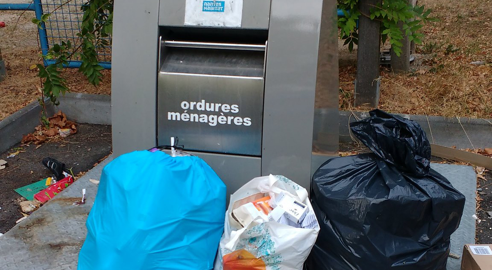
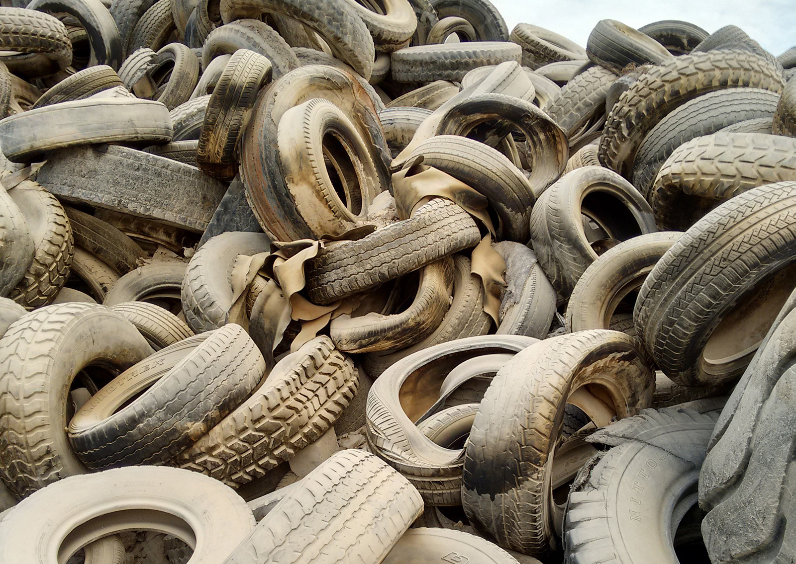
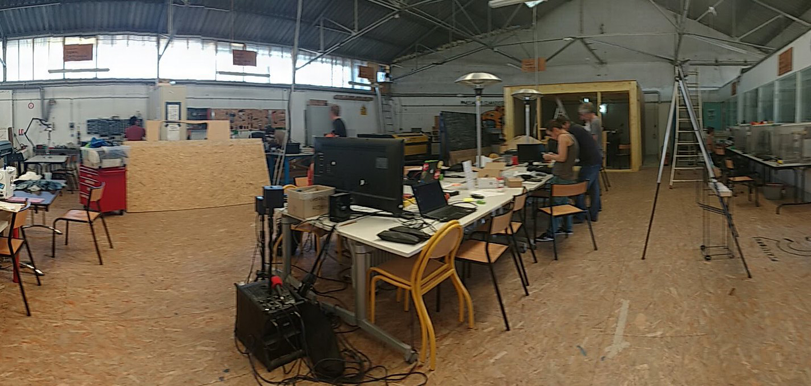
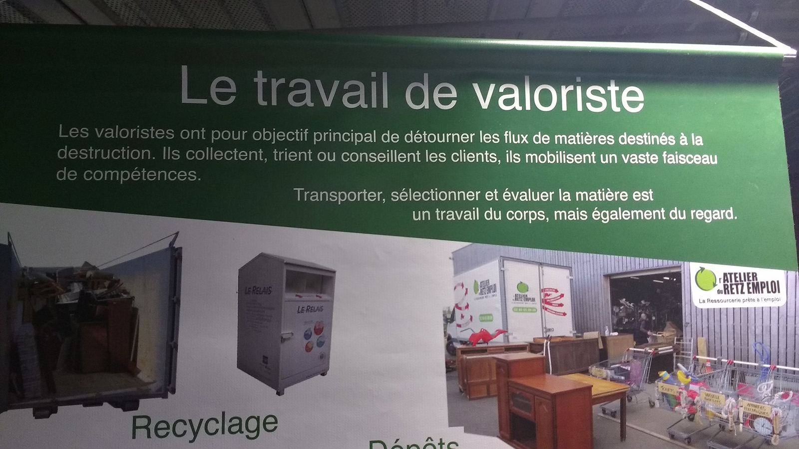
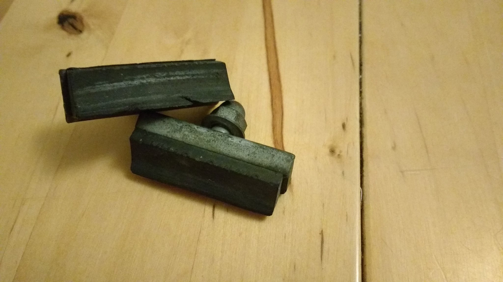
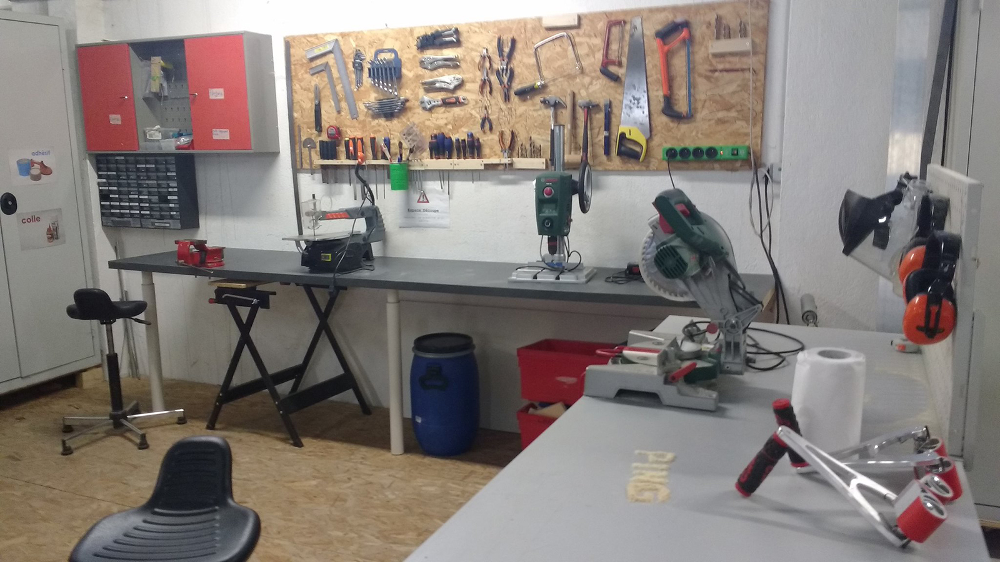

This is the second in a series of texts in which I am drawing the boundaries of my PhD investigation. In the [first one](../city-mattering), I have explored references that bring about a critical perspective on the topic of smart cities. In this one, I will focus on waste management. It is an important theme, often mentioned superficially in the narrative about smart cities. However, it is usually neglected by those set out to create alternatives in a more inclusive, fair, sustainable and participatory way. In this text, I will attempt more specifically to discuss how cities can improve the reuse of materials, instead of sending all of them down the line for recycling, incineration or landfill disposal. Once again I will build on relevant literature, as well as bring anecdotal insights from my experience in previous projects.

If we think of the city as an organism, what does [solid waste](https://en.wikipedia.org/wiki/Municipal_solid_waste) represent? Is it only an unavoidable byproduct of the city’s economic activity, just as everything we humans send down the sewage system? From that perspective, the waste generated in a city should be as quickly as possible washed away, removed and dealt with - preferably out of reach of public eyes. Is it then a sort of societal disease, made of cancerous self-multiplying cells with no proper function except draining energy and clogging circulation?

What if waste was seen alternatively as an indicator of the health of the city-organism? Instead of disappearing automatically through vacuum pipes and managed by robots, it could then be made visible, understood and acted upon. Granted, it would not be the prettiest of images. I still think however that citizens should be aware of how matter circulates locally after they dispose of it. Many new solutions could be leveraged with extra layers of visibility. I am particularly interested in what is to be done to the parts of solid waste that can still be used. They are materials in need of transformation. Currently, most cities and towns in the world are missing the opportunity to put those materials to good use.

It may be obvious to most people reading this text, but I feel it’s important to make it explicit: recycling is not the only solution for solid urban waste. In fact, there are many cases in which recycling is unsustainable, too impactful or downright impractical. Recycling has acquired a positive cultural value over the last decades, embodying a growing concern for the future of the planet. But objectively it is an industrial process whose goal is to collect materials that are not in use and transform them back as much as possible into raw materials that will feed other industrial processes. The requirements for that system to work properly are very high. First of all, there must be a steady influx of recyclable materials, preferably already cleaned up and sorted according to type and quality. There must be an industrial plant with the proper equipment, methodologies, workforce, sources of energy, social responsibility measures and environmental licenses. Finally, there must be an active market willing to buy recycled materials.

Influx, processing, output. Even taken in broad terms, there are many weak points in that design. When one tries to consider other aspects, this fractal setting gains a lot more complexity. For instance, the logistical challenges to collect recyclables and redistribute recycled materials are already high, even if one does not factor in the cost and environmental impact of transporting things within the city - from neighbourhoods to facilities for sorting and recycling, then on to whatever organisations will use the recycled materials for their own production. That image is of course based on the notion of a contemporary western/northern city with ideal transportation modals, a population aware of the benefits of properly sorting recyclables and an industrial sector in need of materials. Most cities and urban areas in the world can not be portrayed that way, which makes things even worst.

Similar to the topic of smart cities, I am no newcomer to issues related to waste, particularly on reuse and repair. Back in the day, I was a proud founding member and one of the leaders of the MetaReciclagem network. MetaReciclagem was active for almost a decade, setting up computer repair labs in partnership with local and national organisations in all regions of Brazil. We got involved with dozens of different social and economic contexts, whilst learning in practice about culturally valuable material practices in Brazil as well as our similarities and differences with the international hacker/maker/fab movement (a story I wrote more extensively about [here](../../stuff/gambiarra-repair-culture)). I have advocated for, and later advised on, policies for e-waste management in Brazil. Some years later I spent a short period as a designer in residence at the VCUQ University in Doha, [exploring practices of repair and reuse](../../stuff/gambi-sand) with the bright students of their MFA in Design program. I spent a couple of months in Nantes (France) and Lüneburg (Germany), investigating the [commonalities between repair, traditional craft and digital making](https://is.efeefe.me/opendott/transformateria). I offered once a short course on repurposing materials found in the streets within a Fablab setting.

Along those years, I have worked many times with communities and groups of students exploring creative approaches to reuse materials. My focus on those occasions was not exactly on a city scale. However, when I proposed participants to reflect upon waste over a local map, they would often place the waste-related facilities in some abstract point outside the city boundaries. In Doha, a student imagined objects piling up in the vast desert. Another student in Dundee recently said he imagined “the city council collects things and probably takes them to a private company that will recycle the materials”. He had no idea where that took place exactly, though.
Post-consumption flows
It is disheartening to realise that despite all the attention recently being given to sustainability and climate change, the field of product design is still very much focused only on everything that happens before a product is purchased. Naturally, there have been important changes over the recent decades as users increasingly became the centre of the design process, which brought real-world use scenarios to the fore. There are also excellent alternatives under development that offer more sustainable sourcing of raw materials. However, there is little thought about what happens once products start failing. Of course, manufacturers are being pressured from the public and policymakers to allow for easier repairability and recyclability of their products (a good example is the [Right to Repair](https://repair.eu/) campaign. Even then, at any given second every city and town in the world is discarding high volumes of materials, and a considerable part of that shouldn’t need to be wasted by recycling, incineration, or end up in landfills.

One of the research exercises I will do in the next months in Dundee is an ecosystem mapping to acquire more information about what happens to things after they fail, break or become obsolete. My focus is not only on proper waste management but will include also repair professionals, charity shops and hopefully amateur makers and fixers. The idea is not merely to add points over the map of a post-industrial city. Rather, I want to expand in two directions: to understand how the city relates to its surroundings in terms of flows of materials, as well as unfolding the black boxes I find here and there. I’ll explain how.

Some years ago I read in [John Thackara’s blog](http://thackara.com/place-bioregion/back-to-the-land-2-0%E2%80%A8-a-design-agenda-for-bioregions/) about the idea of bioregions. It is a perspective that asks one to think in a systemic way that integrates city, countryside and nature. It provides a powerful way to expose assumptions often kept under the radar, as well as to acknowledge externalities. Even though the themes around repair, reuse and waste are not directly related to a rural or natural setting, it’s still useful to think on a scale a little wider than the city in order to understand how matter flows and is transformed within it.

Bruno Latour uses the image of black boxes to describe those spots whose internal functionality is opaque within a system. They are only expected to receive inputs and from them provide outputs efficiently. One may argue that opening up black boxes and making them transparent reduces the overall performance of the system. On the other hand, it is only possible to have a clear picture once we look into the black boxes. The usual diagram of waste management systems is full of black boxes. In order to jump to the next phase of my research, I want to get a closer view of some of them.
Transformation of matter
In the two texts I wrote after my period in Nantes ([Transformed Worlds](https://is.efeefe.me/stuff/transformed-worlds) / [Knowledge, skill and labor](https://is.efeefe.me/stuff/transformed-worlds)), I tried to view the transformation of matter as a deeply human sort of activity that takes place over time. It influences and is influenced by history, politics and culture. I was trying to expand on the other text I had written a couple of years earlier, in which I criticised the very idea of seeing the maker culture as a “new industrial revolution” (why, if we are still not recovered from the many ill effects of the previous ones?). 

When I presented those ideas in Lüneburg, a grumpy German scholar asked me whether I was then proposing to undo the whole modernity and its uncountable accomplishments? Before that conversation, I was still a little blind to how much industrialisation is part of the cultural identity of contemporary Europe. Having been born and raised in a former Atlantic colony whose main role since centuries has been to provide raw materials and food to fuel others’ industrial activity and economic growth makes me a little more cynical. Even so, it was not industrial production as a method to organise the transformation of matter that I was criticising. My target was the unaccounted cost of externalities, which is itself a great part of the whole international economy. If the true impact of industrial production in the environment, sociability and health was taken into account, the profit margins would be smaller - or negative. How to square that circle?

When MetaReciclagem was still active in Brazil, we had the opportunity to collaborate with organisations working on electronic waste in other parts of the world. One day having a coffee with an excited Dutch engineer I learnt about McDonough and Braungart’s book titled Cradle to Cradle. In opposition to systems that work “from cradle to grave”, they proposed that products should be designed in such a way that allows them to be reincorporated by the system once they are not in use anymore. It is again a game aimed at the production side of things. The excitement of my companion was however on many initiatives of upcycling and reuse that were inspired by the book’s view of the flow of matter as a big organic system.

The cradle to cradle perspective is reportedly one of the sources of inspiration for the view on a circular economy as shaped by the [Ellen Macarthur Foundation](https://www.ellenmacarthurfoundation.org/) in the United Kingdom. EMF has been for some years pushing that agenda towards big economic and political actors. I first heard of a circular economy when a member of the Foundation who had read one of my texts put me in contact with the team then taking their activities to Brazil. I even spoke at one of their events - a meeting with dozens of industry executives in a resort by a lake in Florianópolis, southern Brazil. My impression was always that there was something missing from the picture. Indeed, when I first looked for images of “circular economy” on the internet, I would get thousands of results with diagrams and graphs. And almost no humans.

Beyond circularity

One of the many interesting questions I was asked since I moved to Dundee came from Jon Rogers, one of the coordinators of the [OpenDoTT](https://opendott.org) project. How about, he asked me, you thought of shapes other than a circle? Once I let that sink in, I began to understand what my main problem with the circular economy was. We can, inspired by McDonough and Braungart, accept that waste equals food, or in other words that the residues of industrial production could be seen as nutrients that can be fed back to the system. The second step would then be to create ways to ensure that the nutrients are efficiently identified, sorted, cleaned and transformed back into food. But then, what sort of creature are we feeding with it? I mean, should the circular economy be used to provide frictionless nutrient flows to an industrial sector that has proved time and again that its only goal is to reproduce itself over time?

My take would differ in purpose, if not in substance. Instead of nutrients, I like to think of discarded materials as potential wealth. Perhaps the most interesting outcome of those weeks I spent learning about circular economy projects around Nantes was about the valoristes. From what I understood, it is a real professional role: the person whose job is to evaluate what bits of discarded or donated materials can be either sold, repaired, transformed. It reminds me of those TV shows of antique traders going to small towns to find potential acquisitions for their businesses.

One of my favourite authors of near-future fiction is Cory Doctorow. I often say that most people read the wrong book called Makers. Unlike Chris Anderson’s, the one written by Doctorow is a story of a bunch of creative engineers in a warehouse in Florida repurposing the excesses of industrial production. One of them says “the world is full of capacious, capable, disposable junk and it cries out to be used again”. A good valoriste can likewise see beyond the intrinsic characteristics of things and envisions as well how they can be dynamically reconfigured in different situations. For instance, an irreparable object considered worthless for its original use could become valuable for an artist currently looking for its particular characteristics for an artwork. There are many amazing examples, stemming for instance from the [artist in residence program at Recology San Francisco](https://www.recology.com/recology-san-francisco/artist-in-residence-program/).

If we plan to cope with the huge amounts of waste being generated every day, the skills of the valoriste should be recognised and disseminated. Once that happens, we may see the flows of matter not returning in full circle to further fuel the industrial sector, but instead being absorbed within the city in community centres, workshops, social enterprises and nonprofits. Treating waste as potential wealth, it is possible to design abundant systems that fight social and economic inequalities by combining the skills and labour of valoristes, repair and crafts professionals, amateur upcyclers and other groups operating the transformation of matter.

These initiatives would collect materials from their surroundings, identify the potential value they had, make sure that value is reverted to people and organisations in the vicinity that have need of them. Eventually, they would exchange materials with other initiatives in the neighbourhood or beyond it. Only afterwards the materials would be sent back to the final disposal - recycling, incineration, landfill. Taken as a whole, such a system would hardly take the shape of a circle. Perhaps more of a rhizome.

That brings me to the second research exercise I’m planning for the coming months. A group of participants will be handed broken or malfunctioning objects and will spend two weeks trying to get them repaired or made valuable in any sense. I want to understand how the value of those objects is perceived in different contexts. I expect participants to engage with the community of local repair people and report back on their experience. By the end, we will host a workshop trying to identify potentialities and weaknesses of the city of Dundee in such matters, and how that could translate in the future into feasible changes.

As my research evolves in the coming years, I expect to contribute more concretely to building better alternatives. It may be by creating technological solutions - sensors, equipment, online resources - that help to identify and sort reusable materials, allowing more people to become networked valoristes, so to speak. We could use blockchain and online ledgers to track the lifecycle of particular objects, as some projects are already doing. I could band together with people who are developing apps for rag pickers in developing countries and see how my research could help. Or develop concepts for city-based (or better yet, bioregional) centres for the transformation of available matter. I hope to find ways to escape the seldom challenged idea that only privately owned corporations should be in charge of all the processes related to waste management. They are already aware that besides getting paid for these services by taxpayers, there’s good money to be made once they pay more attention to the material composition of waste. Are they worthy of being freely given such a valuable present?

In my next blog post, I plan to discuss the idea of managing the universe of potentially usable materials as a commons, with collective stewardship and open cooperative governance. In a sense, I may be trying to bridge the idea of technological sovereignty I referred to in my [previous text](../city-mattering) and think of, say, material sovereignty for cities. I gave up trying to predict how long I take to write anything but would be happy to get recommendations of references and insights about such themes during the coming weeks.

---

This text was originally posted to the [OpenDoTT website](https://opendott.org/posts/waste-value-and-reuse/). For comments, check the versions on [Medium](https://medium.com/@felipefonseca/waste-value-and-reuse-1c81137bfe32) or [LinkedIn](https://www.linkedin.com/pulse/waste-value-reuse-felipe-schmidt-fonseca/)