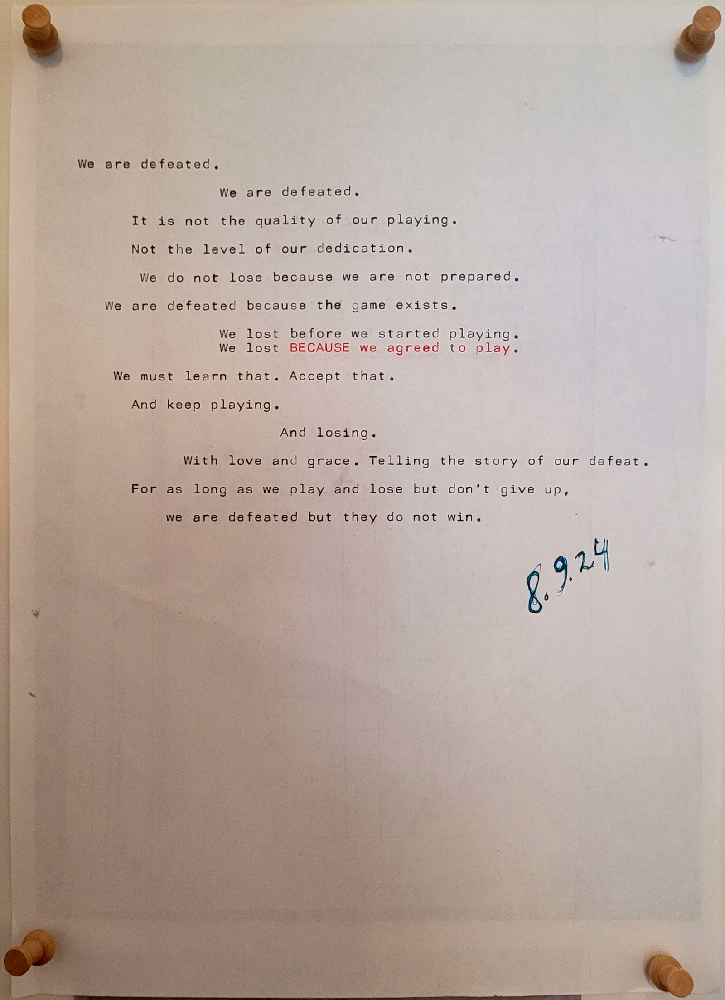

We are defeated.

We are defeated.

It is not the quality of our playing.

Not the level of our dedication.

We do not lose because we are not prepared.

We are defeated because the game exists.

We lost before we started playing.  
We lost BECAUSE we agreed to play.

We must learn that. Accept that.

And keep playing.

And losing.

With love and grace. Telling the story of our defeat.

For as long as we play and lose but don't give up, we are defeated but they do not win.

Berlin, 8.9.24

