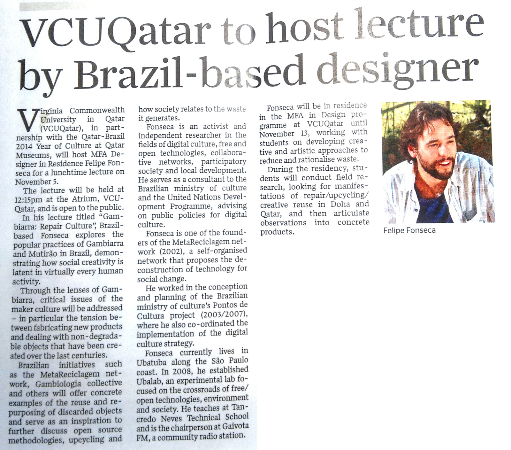

During two weeks in 2014, I was a Designer in Residence at the Virginia Commonwealth University Qatar, in Doha. The invitation came in the context of a "Brazil-Qatar Culture year" connected to the FIFA Football World Cups. And that was not the most uncommon part. It was a relatively short immersion that got me to reflect on many aspects of contemporary times and echoed in many of my following projects.

I worked with a group of students from their MFA in Design. The topic I explored was "repair studies", and how repair could relate to design, culture, and the economy. It was a very uncommon combination of factors. On the one hand, a country so unlike any other I had been before in political terms - for instance, the parlament had been voted once in the past and never renovated. Qatari citizens - a minority in absolute terms, amid a large immigrant population - didn't have to pay taxes, and if I'm not mistaken not even energy bills. On the other hand, Qatar had been investing for years in media, education, architecture, and the arts. It had one of the largest budgets for art acquisition in the world. It is the home of Al-Jazeera. The then queen was a patron of education, and notably the bright students I worked with were women in their majority. The country had then a strategic plan to stop depending economically on fossil fuels by 2030 (I wonder what is the state of that nowadays). My experience in Qatar was a mixture of sci-fi (leaning toward the dystopian side, of course), creative insights and good reminders of humanity amid extreme contexts.

Some outputs of the residency were:

- Images collected during [fieldwork](fieldwork) with [crafters and repairers](fieldwork/craft), [dumpsites in the desert](fieldwork/desert) (and some [psychogeography](psychogeography)), as well as a [repair cafe and some upcycling experiments](sallehlab) at the University. Most of the images were shared earlier on an [Album on Flickr](https://www.flickr.com/photos/felipefonseca/sets/72157649068360535/) before being edited.
- The text Gambiarra: repair culture, initially published in Makery ([English](https://www.makery.info/en/2015/03/31/gambiarra-la-culture-de-la-reparation/) / [French](https://www.makery.info/en/2015/03/31/gambiarra-la-culture-de-la-reparation/?lang=fr)). An improved version was included in an issue of [Tvergastein](https://www.academia.edu/20808625/Gambiarra_Repair_Culture). A copy of the text is kept here in [my blog](https://is.efeefe.me/stuff/gambiarra-repair-culture).
- By the end of the residency, one of the professors started organising a publication with photos of the activities. I wrote a text and contributed with some images, but we never properly finished the publication. A working version, however, can be found [here](repair-culture).
- A microblog [on Tumblr](https://repairculture.tumblr.com/) during the residency (I keep a [copy here](repairculture-tumblr) to make sure it doesn't disappear).
- Interim blog posts (in Portuguese):
  - [Gambiarra Studies](https://desvio.github.io/blog/gambiarra-studies/)
  - [Chegando a Doha](https://desvio.github.io/blog/chegando-doha/)
  - [Meio-relato](https://desvio.github.io/blog/meio-relato-residencia-na-vcuqatar-em-doha/)
- Some impressions would also be published a couple of years later, in the fourth edition of Facta Magazine under the title [Gambi-sand](https://is.efeefe.me/stuff/gambi-sand) ([in Portuguese, Gambiareia](https://transformateria.wordpress.com/2017/11/30/gambiareia/)).
- Oh, and an actual story at the local newspaper:

