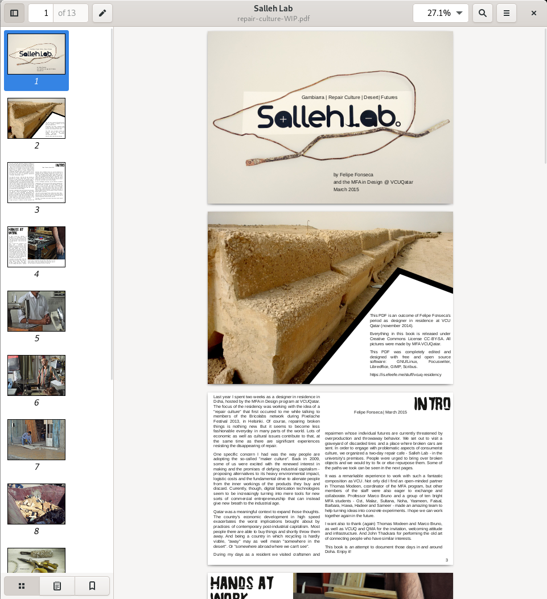

Outline of a publication based on my [residency at the VCUQ](../) in 2014. The publication was never properly completed, but notes and sketches can be seen below. The most recent version of the (stalled) working version is available as a PDF [here](repair-culture-WIP.pdf). The publication was initiated by professor Marco Bruno (VCUQ) with an outline and student-contributed photos of our [field trips](../fieldwork) and [lab](../sallehlab). Some months later I added an introductory text and started designing the publication on Scribus. As the project never became a priority, it was kept offline until I reaccessed that folder in 2024. I then decided to share it publicly and leave it as it is.

