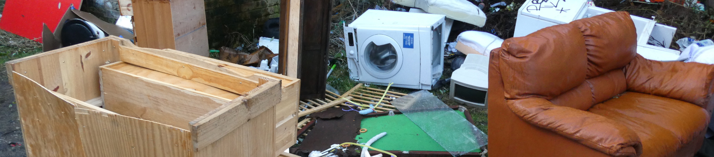

# OpenDoTT
## Waste Avoidance in Smart Cities

I am Felipe Schmidt Fonseca, a researcher at [Northumbria University](https://www.northumbria.ac.uk/). At the time of publishing this page (August 2020), I am working on [design concepts](#design-concepts) that respond to insights on data collected during my [first year of research](../opendott/research-progress) in the [OpenDoTT](https://opendott.org) project.

I have sketched eight concept ideas, listed below and further detailed in individual pages. These concepts and their descriptions will expand or contract as my research evolves over time.

More information about my research focus can be found [here](../opendott/focus) and in my [research blog](../opendott).

## Design Concepts

These are responses to issues and insights identified while exploring the idea of *waste avoidance* in cities and towns, and how that field should relate to smart city projects. These ideas are not meant to be radically new; should rather contribute to build a systemic, commons based approach that allows society as a whole to benefit from the potential value that lies on secondary flows of matter.

The concepts can be grouped in three main categories:

  

    <h4>
      Apps/Websites/Databases
    </h4>
    

      <ul>
        <li>
          <a href="concepts/universal-registry-things">
          Universal Registry of Things
          </a>
        </li>
        <li>
          <a href="concepts/point-reuse">
          Point and Reuse
          </a>
        </li>
        <li>
          <a href="concepts/save-this-thing">
          Save this Thing
          </a>
        </li>
    

  

  

    <h4>
      Data/Visibility
    </h4>
    

      <ul>
        <li>
          <a href="concepts/make-waste-visible">
          Make Waste Visible
          </a>
        </li>
        <li>
          <a href="concepts/data-reuse">
          Data on Reuse
          </a>
        </li>
    

  

  

    <h4>
      Reuse in the City
    </h4>
    

      <ul>
        <li>
          <a href="concepts/reuse-commons">
          Reuse Commons
          </a>
        </li>
        <li>
          <a href="concepts/transformation-lab">
          Transformation Lab
          </a>
        </li>
        <li>
          <a href="concepts/reuse-bin">
          Reuse Bin
          </a>
        </li>
    

  

Right now I am expecting to gather feedback on those concepts in order to verify their relevance and prioritise further phases of development. Please send your comments to my email (if you have it already) or use this one: 5wbi948e9@relay.firefox.com.
