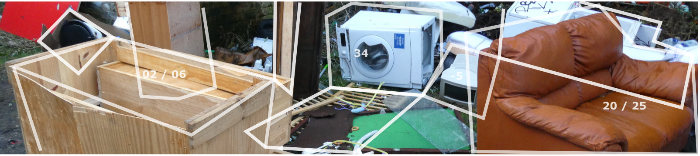

# OpenDoTT
## Waste Avoidance in Smart Cities

I am Felipe Schmidt Fonseca, a researcher at [Northumbria University](https://www.northumbria.ac.uk/). At the time of publishing this page (August 2020), I am working on [design concepts](#design-concepts) that respond to insights on [data](#research-data) collected during my [first year of research](../opendott/research-progress) in the [OpenDoTT](https://opendott.org) project.

I have sketched eight concept ideas, listed below and further detailed in individual pages. These concepts and their descriptions will be edited as my research evolves over time.

I am expecting to gather feedback on those concepts in order to understand their relevance and prioritise further phases of development. Please send your comments to my email address if you have it already. Alternatively, please use this one: [5wbi948e9@relay.firefox.com](mailto:5wbi948e9@relay.firefox.com).

More information about my research focus can be found [here](../opendott/focus) and in my [research blog](../opendott).

## Research data

The concepts are mainly based on data coming from two research studies:

- [Repair Journey](../opendott/repair-journey) - seven participants were invited to spend some weeks trying to repair or repurpose broken objects, and were interviewed at the end to discuss what were their challenges and discoveries along the way.
- [Ecosystem Mapping](../opendott/ecosystem-mapping) - five people working on the reuse or re-circulation of second-hand goods were interviewed in order to compose an overview of the field.

Other contributions to the concept ideas came from:

- My ongoing literature review - part of it documented in the [research blog](../opendott).
- Previous experience in other projects on reuse and maintenance.
- Attendance of online courses on [Waste Management in Developing Countries](https://www.coursera.org/learn/solid-waste-management) and [Platform Cooperativism](https://platform.coop/blog/pcc-mondragon-university-offer-online-course-to-incubate-platform-co-ops/).

### Target groups

Even though the boundaries are somewhat blurred, each concept idea connects to at least one out of four target groups identified in the research:

- Citizen
 - Individual/household who has broken or unwanted things.
 - Individual/household who is interested in acquiring affordable things.
- Community
 - Group or organisation willing to generate income for community members
 - Volunteer group or not-for-profit organisation in charge of repair cafes, clothes swaps and other zero-waste projects.
- Professional Reuse
 - Social enterprises or SMEs working on the selection, transformation and redistribution of second-hand materials.
- Local Authority
 - City council or similar local government body looking into social, environmental and economic benefits of encouraging the reuse of materials.

## Design Concepts

The ideas below are responses to issues and insights identified while exploring the idea of *waste avoidance* in cities and towns, and how those kinds of initiatives are largely absent from smart city projects. These ideas are not meant to be radically new. Rather, the intention is contributing to build a systemic, commons-based approach that allows society as a whole to benefit from the potential value that lies on secondary flows of matter.

The concepts can be grouped in three main categories:

  

    <h4>
      Apps/Websites/Databases
    </h4>
    

      <ul>
        <li>
          <a href="concepts/universal-registry-things">
          Universal Registry of Things
          </a>
        </li>
        <li>
          <a href="concepts/point-reuse">
          Point and Reuse
          </a>
        </li>
        <li>
          <a href="concepts/save-this-thing">
          Save this Thing
          </a>
        </li>
    

  

  

    <h4>
      Data/Visibility
    </h4>
    

      <ul>
        <li>
          <a href="concepts/make-waste-visible">
          Make Waste Visible
          </a>
        </li>
        <li>
          <a href="concepts/data-reuse">
          Data on Reuse
          </a>
        </li>
    

  

  

    <h4>
      Reuse in the City
    </h4>
    

      <ul>
        <li>
          <a href="concepts/reuse-commons">
          Reuse Commons
          </a>
        </li>
        <li>
          <a href="concepts/transformation-lab">
          Transformation Lab
          </a>
        </li>
        <li>
          <a href="concepts/reuse-bin">
          Reuse Bin
          </a>
        </li>
    

  

## More details
