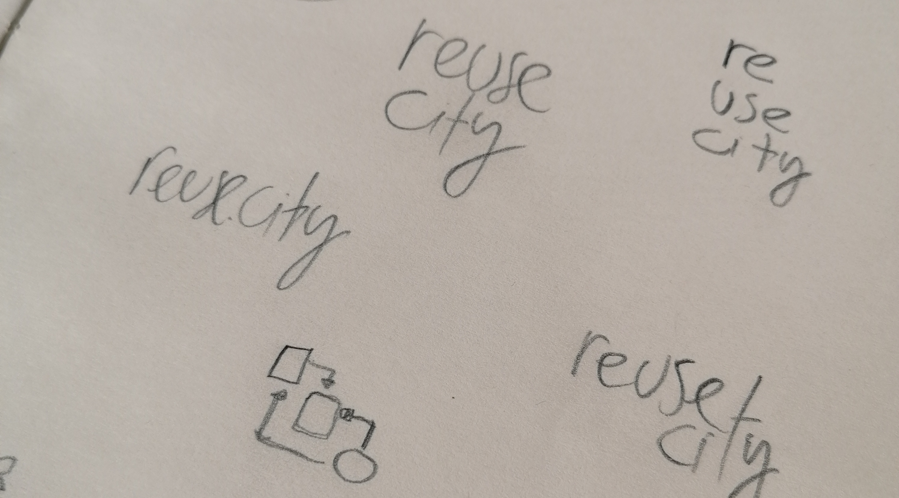

# reuse.city

Hi, and welcome to reuse.city. I am [Felipe Schmidt Fonseca](https://is.efeefe.me), a PhD researcher in the [OpenDoTT project](https://opendott.org) (Northumbria University / Mozilla Foundation). My current [research questions](https://is.efeefe.me/opendott/questions) revolve around waste prevention through practices of reuse.

This page holds the ongoing documentation of my current efforts to co-design and prototype technologies and other ways to help assess the potential value of discarded materials. It will be updated in tandem with meta-documentation on [this git repository](https://github.com/opendott-smartcities/II/).

## Help needed

I am currently inviting people interested in joining a series of activities to take place online during the month of April 2021. I will update this page frequently to inform how you can help.

- If you want to join one or more of the co-design workshops taking place online in April, please [fill this sign up form](https://forms.gle/rat12rsPstvg89aX9). Alternatively, you can download PDF versions of the [Participant Information Sheet](participant-information.pdf) and [Informed Consent Form](consent-form.pdf), sign the consent form and send it to me via email (you can find my email address in the PDF).
- If you just want to be informed of future developments, please [fill this form](https://forms.gle/BJoPHMk2NEj1HHxd7). If you prefer, contact me on [Twitter](https://twitter.com/efeefe), [Linkedin](https://www.linkedin.com/in/felipefonseca/) or via [e-mail](5wbi948e9@relay.firefox.com).

## Open Studio - April 2021

- Throughout the month - online conversations (scheduled via mailing list, restricted to subscribers + telegram group).
