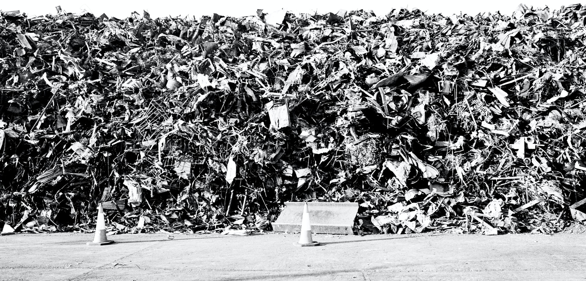

# reuse.city

Hi, and welcome. I am [Felipe Schmidt Fonseca](https://is.efeefe.me), a PhD researcher in the [OpenDoTT project](https://opendott.org) (Northumbria University / Mozilla Foundation). My current [research questions](https://is.efeefe.me/opendott/questions) revolve around waste prevention through practices of reuse. Learn more about my research [here](../opendott).

This page started as a index to ongoing documentation of my efforts to co-design and prototype technologies and other ways to help assess the potential value of discarded materials. Those activities were developed under the name reuse.city and were documented in a [git repository](https://github.com/reuse-city/lab/). They were included in my deliverabled for the [second year of research](https://github.com/opendott-smartcities/II/).

More information about my research can be found on [reuse.city](https://reuse.city).
